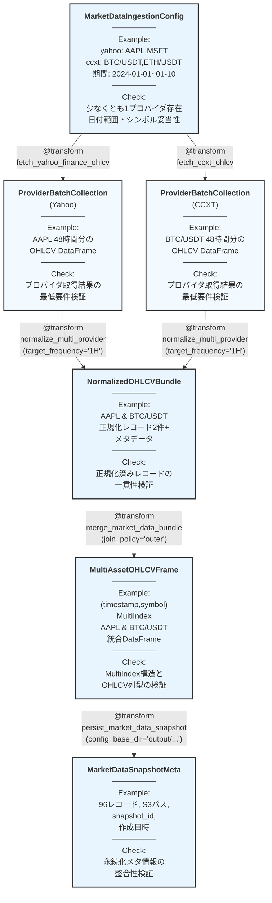

# algo-trade-app Market Data Ingestion 仕様

## 概要

Yahoo Finance（株式/ETF）と CCXT 経由の暗号資産 OHLCV データを共通フォーマットへ正規化し、下流の特徴量生成・学習パイプラインへ渡す Transform 群の仕様を定義する。中間の *Request* 型は設けず、`MarketDataIngestionConfig` から各プロバイダの取得・正規化を直接行う構成とし、型メタデータは `RegisteredType` で集約管理する。

## パイプライン構造



## 作成する型定義（`apps/algo-trade-app/algo_trade_dtype/types.py`）

既存の `Frequency` や `CurrencyPair` を再利用しつつ、以下の新規 TypedDict / StrEnum を追加する。

```python
from typing import List, Dict, Optional
from typing_extensions import TypedDict
from enum import StrEnum
import pandas as pd

class MarketDataProvider(StrEnum):
    """市場データプロバイダ識別子。"""

    YAHOO = "yahoo"
    CCXT = "ccxt"


class CCXTExchange(StrEnum):
    """CCXT で利用する取引所識別子。"""

    BINANCE = "binance"
    BYBIT = "bybit"
    KRAKEN = "kraken"


class YahooFinanceConfig(TypedDict):
    """Yahoo Finance データ取得設定。"""

    tickers: List[str]       # 例: ["AAPL", "MSFT"]
    start_date: str          # ISO8601 (YYYY-MM-DD)
    end_date: str            # ISO8601 (YYYY-MM-DD)
    frequency: Frequency     # 最小粒度: 1日 (Yahoo Finance の制約)
    use_adjusted_close: bool


class CCXTConfig(TypedDict):
    """CCXT データ取得設定。"""

    symbols: List[str]       # 例: ["BTC/USDT", "ETH/USDT"]
    start_date: str          # ISO8601 (YYYY-MM-DD)
    end_date: str            # ISO8601 (YYYY-MM-DD)
    frequency: Frequency     # 最小粒度: 1分 (取引所による)
    exchange: CCXTExchange
    rate_limit_ms: int       # レート制限 (ミリ秒)


class MarketDataIngestionConfig(TypedDict, total=False):
    """プロバイダ横断の取得条件（使用するプロバイダのみ指定）。"""

    yahoo: YahooFinanceConfig     # オプショナル
    ccxt: CCXTConfig              # オプショナル


class ProviderOHLCVBatch(TypedDict):
    """単一シンボルの取得結果とメタ情報。"""

    provider: MarketDataProvider
    symbol: str
    frame: pd.DataFrame      # 各行は FXDataSchema (OHLCVSchema) に準拠
    frequency: Frequency


class ProviderBatchCollection(TypedDict):
    """特定プロバイダの一括取得結果。"""

    provider: MarketDataProvider
    batches: List[ProviderOHLCVBatch]


class NormalizedOHLCVBundle(TypedDict):
    """正規化済み OHLCV データと メタデータ。

    frame: 正規化済み DataFrame
        - 列: timestamp (DatetimeIndex), provider, symbol, open, high, low, close, volume
        - provider 列は MarketDataProvider enum の文字列表現
    metadata: リサンプリング設定などのメタ情報
    """

    frame: pd.DataFrame      # 列: timestamp, provider, symbol, open, high, low, close, volume
    metadata: Dict[str, str]


class MultiAssetOHLCVFrame(TypedDict):
    """MultiIndex DataFrame をラップした構造。"""

    frame: pd.DataFrame      # index=(timestamp, symbol), 列は FXDataSchema (OHLCVSchema) 準拠
    symbols: List[str]
    providers: List[str]


class MarketDataSnapshotMeta(TypedDict):
    """永続化済みスナップショットのメタ情報。

    注: この型は persist_market_data_snapshot の出力として、
    スナップショットの記録・追跡・監査に使用される。
    データ読み込み時は storage_path を直接 load_market_data に渡す。
    """

    snapshot_id: str
    record_count: int
    storage_path: str
    created_at: str          # ISO8601 (UTC)
```

### RegisteredType 登録方針

- 上記 TypedDict すべてを `RegisteredType` で登録し、Example / Check を型レベルで付与する。
- `ProviderOHLCVBatch.frame` は既存の `DataFrameReg`（OHLCV チェック付き）を再利用。
- `ProviderBatchCollection.batches` や `ProviderBatchAggregate.batches` の例は `gen_provider_aggregate` など静的値を返すジェネレータで供給する。

## 作成する Example（`apps/algo-trade-app/algo_trade_dtype/generators.py`）

```python
def gen_ingestion_config() -> MarketDataIngestionConfig:
    """両方のプロバイダを使用する例。"""
    return {
        "yahoo": {
            "tickers": ["AAPL", "MSFT"],
            "start_date": "2024-01-01",
            "end_date": "2024-01-10",
            "frequency": Frequency.HOUR_1,
            "use_adjusted_close": True,
        },
        "ccxt": {
            "symbols": ["BTC/USDT", "ETH/USDT"],
            "start_date": "2024-01-01",
            "end_date": "2024-01-10",
            "frequency": Frequency.HOUR_1,
            "exchange": CCXTExchange.BINANCE,
            "rate_limit_ms": 1000,
        },
    }


def gen_yahoo_only_config() -> MarketDataIngestionConfig:
    """Yahoo Finance のみを使用する例（日足データ）。"""
    return {
        "yahoo": {
            "tickers": ["AAPL", "MSFT", "GOOGL"],
            "start_date": "2024-01-01",
            "end_date": "2024-01-10",
            "frequency": Frequency.DAY_1,  # Yahoo Finance は日足が最小粒度
            "use_adjusted_close": True,
        },
    }


def gen_ccxt_only_config() -> MarketDataIngestionConfig:
    """CCXT のみを使用する例（分足データ）。"""
    return {
        "ccxt": {
            "symbols": ["BTC/USDT", "ETH/USDT"],
            "start_date": "2024-01-01",
            "end_date": "2024-01-10",
            "frequency": Frequency.MIN_15,  # CCXT は分足から取得可能
            "exchange": CCXTExchange.BINANCE,
            "rate_limit_ms": 1000,
        },
    }


def gen_mixed_frequency_config() -> MarketDataIngestionConfig:
    """異なる粒度のデータソースを混在させる例。"""
    return {
        "yahoo": {
            "tickers": ["AAPL", "MSFT"],
            "start_date": "2024-01-01",
            "end_date": "2024-01-10",
            "frequency": Frequency.DAY_1,  # 日足
            "use_adjusted_close": True,
        },
        "ccxt": {
            "symbols": ["BTC/USDT", "ETH/USDT"],
            "start_date": "2024-01-01",
            "end_date": "2024-01-10",
            "frequency": Frequency.HOUR_1,  # 時間足
            "exchange": CCXTExchange.BINANCE,
            "rate_limit_ms": 1000,
        },
    }


def gen_yahoo_batch_collection() -> ProviderBatchCollection:
    frame = gen_sample_ohlcv(n=48, start_price=150.0, seed=7)
    frame.reset_index(inplace=True)
    batch = {
        "provider": MarketDataProvider.YAHOO,
        "symbol": "AAPL",
        "frame": frame,
        "frequency": Frequency.HOUR_1,
    }
    return {"provider": MarketDataProvider.YAHOO, "batches": [batch]}


def gen_ccxt_batch_collection() -> ProviderBatchCollection:
    frame = gen_sample_ohlcv(n=48, start_price=45000.0, seed=11)
    frame.reset_index(inplace=True)
    batch = {
        "provider": MarketDataProvider.CCXT,
        "symbol": "BTC/USDT",
        "frame": frame,
        "frequency": Frequency.HOUR_1,
    }
    return {"provider": MarketDataProvider.CCXT, "batches": [batch]}


def gen_normalized_bundle() -> NormalizedOHLCVBundle:
    data = [
        {
            "timestamp": pd.Timestamp("2024-01-01T00:00:00Z"),
            "provider": MarketDataProvider.YAHOO.value,
            "symbol": "AAPL",
            "open": 150.0,
            "high": 151.0,
            "low": 149.5,
            "close": 150.5,
            "volume": 1_200_000.0,
        },
        {
            "timestamp": pd.Timestamp("2024-01-01T00:00:00Z"),
            "provider": MarketDataProvider.CCXT.value,
            "symbol": "BTC/USDT",
            "open": 45000.0,
            "high": 45200.0,
            "low": 44850.0,
            "close": 45120.0,
            "volume": 320.5,
        },
    ]
    frame = pd.DataFrame(data)
    return {
        "frame": frame,
        "metadata": {"target_frequency": "1H", "source_count": "2"},
    }


def gen_multiasset_frame() -> MultiAssetOHLCVFrame:
    normalized = gen_normalized_bundle()
    frame = normalized["frame"].copy()
    frame.set_index(["timestamp", "symbol"], inplace=True)
    return {
        "frame": frame,
        "symbols": ["AAPL", "BTC/USDT"],
        "providers": [MarketDataProvider.YAHOO.value, MarketDataProvider.CCXT.value],
    }


def gen_snapshot_meta() -> MarketDataSnapshotMeta:
    return {
        "snapshot_id": "snapshot_a3f2c8b1e4d6f9a0_2024-01-01_2024-01-10",
        "record_count": 96,
        "storage_path": "output/data/snapshots/a3f2c8b1e4d6f9a0/2024-01-01_2024-01-10/market.parquet",
        "created_at": "2024-01-10T00:15:00Z",
    }
```

## 作成する Check 関数（`apps/algo-trade-app/algo_trade_dtype/checks.py`）

```python
def check_ingestion_config(config: MarketDataIngestionConfig) -> None:
    """日付範囲、対象シンボル、周波数設定の妥当性を検証。"""
    # 少なくとも yahoo または ccxt のいずれかが存在することを確認。
    # 各プロバイダ設定で start_date < end_date、シンボル/ticker重複なしを検証。


def check_batch_collection(collection: ProviderBatchCollection) -> None:
    """各プロバイダの取得結果が最低要件を満たすか検証。"""
    # provider 名の正当性、batches の各要素に対して check_provider_batch を再利用。


def check_provider_batch(batch: ProviderOHLCVBatch) -> None:
    """個別バッチの DataFrame 構造を検証。"""
    # timestamp 昇順、OHLCV 列の存在、volume の有限性など。


def check_normalized_bundle(bundle: NormalizedOHLCVBundle) -> None:
    """正規化済み DataFrame の一貫性を検証。"""
    # DataFrame 構造: timestamp, provider, symbol, open, high, low, close, volume
    # 価格 > 0、timestamp が DatetimeIndex または Timestamp、provider/symbol の非空を確認。


def check_multiasset_frame(frame_info: MultiAssetOHLCVFrame) -> None:
    """MultiIndex DataFrame が想定構造を満たすか検証。"""
    # index=(timestamp,symbol)、列セットが OHLCV のみ、dtype が float64/int64。


def check_snapshot_meta(meta: MarketDataSnapshotMeta) -> None:
    """永続化メタ情報の整合性を検証。"""
    # snapshot_id フォーマット、record_count > 0、storage_path prefix を検証。
```

## RegisteredType 追加一覧（`apps/algo-trade-app/algo_trade_dtype/registry.py`）

| 型 | Example | Check |
| --- | --- | --- |
| `MarketDataIngestionConfig` | `gen_ingestion_config()` / `gen_yahoo_only_config()` / `gen_ccxt_only_config()` | `check_ingestion_config` |
| `YahooFinanceConfig` | `gen_ingestion_config()["yahoo"]` | 既存のチェックで対応 |
| `CCXTConfig` | `gen_ingestion_config()["ccxt"]` | 既存のチェックで対応 |
| `ProviderOHLCVBatch` | `gen_yahoo_batch_collection()["batches"][0]` | `check_provider_batch` |
| `ProviderBatchCollection` | `gen_yahoo_batch_collection()` / `gen_ccxt_batch_collection()` | `check_batch_collection` |
| `NormalizedOHLCVBundle` | `gen_normalized_bundle()` | `check_normalized_bundle` |
| `MultiAssetOHLCVFrame` | `gen_multiasset_frame()` | `check_multiasset_frame` |
| `MarketDataSnapshotMeta` | `gen_snapshot_meta()` | `check_snapshot_meta` |
| `MarketDataProvider` | `MarketDataProvider.YAHOO` など列挙値 | 既存の列挙チェック（新設不要なら `None`） |
| `CCXTExchange` | `CCXTExchange.BINANCE` など列挙値 | 既存の列挙チェック（新設不要なら `None`） |

## 作成する Transformer（`apps/algo-trade-app/algo_trade_app/market_data.py` 想定）

```python
@transform
def fetch_yahoo_finance_ohlcv(
    config: YahooFinanceConfig,
) -> ProviderBatchCollection:
    """yfinance から ticker 群を取得し、ProviderBatchCollection として返す。"""
```
- `config["tickers"]` をループし、`yfinance.download` で取得。
- `config["use_adjusted_close"]` に応じて `Adj Close` を `close` に置き換え。
- 欠損行を削除し、`provider=MarketDataProvider.YAHOO` を付与した `ProviderOHLCVBatch` を構築。

```python
@transform
def fetch_ccxt_ohlcv(
    config: CCXTConfig,
) -> ProviderBatchCollection:
    """CCXT 取引所から暗号資産の OHLCV を取得。"""
```
- `config["exchange"]` を利用して `ccxt` クライアントを初期化。
- `config["symbols"]` ごとに `fetch_ohlcv` を実行し、`provider=MarketDataProvider.CCXT` として格納。
- `config["rate_limit_ms"]` に従ってレート制限を適用、失敗時は指数バックオフで再試行。

```python
@transform
def normalize_multi_provider(
    *provider_batches: ProviderBatchCollection,
    target_frequency: Frequency = Frequency.HOUR_1,
    resample_method: str = "forward_fill",  # "forward_fill" or "upsample"
) -> NormalizedOHLCVBundle:
    """複数プロバイダの取得結果を統一スキーマへ変換。

    可変長引数で複数のプロバイダバッチを受け取り、内部で集約してから正規化する。
    provider と symbol の組が重複しないことを検証。
    """
```
- 各 DataFrame を UTC にそろえ、`target_frequency` へリサンプリング。
- **リサンプリング方針**:
  - **ダウンサンプリング** (分足→時間足、時間足→日足): OHLCV の集約ルールを適用 (open=first, high=max, low=min, close=last, volume=sum)
  - **アップサンプリング** (日足→時間足):
    - `resample_method="forward_fill"`: 前方補完（リーク防止のため、未来のデータは使わない）
    - `resample_method="upsample"`: エラーを発生（粒度の粗いデータを細かくすることは推奨しない）
- **リーク防止**: リサンプリング時に未来のデータを参照しないよう、`label='left'`, `closed='left'` を使用。
- OHLCV 列を float64 にキャストし、DataFrame として返す（列: timestamp, provider, symbol, open, high, low, close, volume）。

```python
@transform
def merge_market_data_bundle(
    bundle: NormalizedOHLCVBundle,
    *,
    join_policy: str = "outer",
) -> MultiAssetOHLCVFrame:
    """正規化 DataFrame を MultiIndex DataFrame に変換。"""
```
- `bundle["frame"]` から `(timestamp, symbol)` を MultiIndex として設定。
- `join_policy` に応じて `outer` / `inner` を制御し、欠損を前方補完する。
- provider 情報は MultiIndex に含めず、別途 `providers` リストに格納。

```python
@transform
def persist_market_data_snapshot(
    multiasset_frame: MultiAssetOHLCVFrame,
    config: MarketDataIngestionConfig,
    *,
    base_dir: str = "output/data/snapshots",
) -> MarketDataSnapshotMeta:
    """Parquet へ書き出し、config から一意のパスを自動生成。

    パス形式: {base_dir}/{config_hash}/{date_range}/market.parquet
    - config_hash: config の SHA256 ハッシュ（16桁、再現性担保）
    - date_range: start_date と end_date から抽出（例: 2024-01-01_2024-01-10）

    同じ config から生成されたデータは常に同じパスに保存され、
    TransformFn のキャッシュキーと整合性が保たれる。
    """
```
- `config` から SHA256 ハッシュ（16桁）と日付範囲を抽出してパスを自動生成。
- `base_dir` は環境変数 `MARKET_DATA_BASE_DIR` で上書き可能（デフォルト: `output/data/snapshots`）。
- 実際の書き出しは I/O 層に委譲し、メタ情報を TypedDict で返す。
- `base_dir` はローカルパスをデフォルトとし、S3パス（`s3://...`）にも対応。

```python
@transform
def load_market_data(
    storage_path: str,
    *,
    format: str = "auto",
) -> MultiAssetOHLCVFrame:
    """ファイルパスから市場データを読み込み。

    公式スナップショット、ローカルファイル、外部データなど、
    任意のデータソースから MultiAssetOHLCVFrame を構築する汎用 Transform。
    予測パイプラインはこの Transform の出力を入力として受け取ることで、
    データソースに依存しない設計を実現する。

    Args:
        storage_path: データファイルのパス（ローカル or s3://）
        format: ファイル形式（"parquet", "csv", "auto"）
    """
```
- `format="auto"` の場合、拡張子から形式を判定（`.parquet` or `.csv`）。
- S3 パス（`s3://...`）とローカルパス両方に対応。
- 読み込んだ DataFrame から `MultiAssetOHLCVFrame` を構築して返却。
- `symbols` と `providers` は DataFrame から抽出（存在しない場合は空リスト）。
- CSV 読み込み時は MultiIndex 構造を想定（`timestamp`, `symbol` を index に設定）。

## Audit 実行

```bash
uv run python -m xform_auditor apps/algo-trade-app/algo_trade_app/market_data.py
```

期待結果: `6 transforms, 6 OK, 0 VIOLATION, 0 ERROR, 0 MISSING`

## 実装メモ

### データソースごとの時間粒度制約

- **Yahoo Finance**: 最小粒度は**日足** (`Frequency.DAY_1`)。分足・時間足は取得不可。
- **CCXT**: 取引所により異なるが、**分足** (`Frequency.MIN_1`) から取得可能。
- `check_ingestion_config` で各プロバイダの `frequency` が最小粒度制約を満たすか検証する。

### リサンプリングとリーク防止

- **ダウンサンプリング** (高頻度→低頻度): 安全。OHLCV集約ルールを適用。
  - 例: 1分足 → 1時間足、1時間足 → 1日足
- **アップサンプリング** (低頻度→高頻度): 注意が必要。
  - `resample_method="forward_fill"`: 前方補完（過去のデータのみ使用、リークなし）
  - `resample_method="upsample"`: エラー発生（粒度の粗いデータを細かくすることは非推奨）
- **リーク防止の実装例**:
  ```python
  # ダウンサンプリング（1時間足 → 1日足）
  df_daily = df_hourly.resample('1D', label='left', closed='left').agg({
      'open': 'first',
      'high': 'max',
      'low': 'min',
      'close': 'last',
      'volume': 'sum'
  })

  # アップサンプリング（1日足 → 1時間足、前方補完）
  df_hourly = df_daily.resample('1H', label='left', closed='left').ffill()
  ```
- `label='left'` と `closed='left'` により、各時間窓の**左端**（開始時刻）のデータのみを使用し、未来のデータを参照しない。

### 異なる粒度のデータソース混在時の注意

- `gen_mixed_frequency_config()` のように、日足と時間足を混在させる場合:
  - `normalize_provider_batches` で統一粒度へリサンプリング
  - `target_frequency` は**最も粗い粒度**に合わせるのが安全（例: 日足に統一）
  - または、`merge_market_data_bundle` で `join_policy="outer"` を使い、欠損を前方補完

### データソース抽象化とパイプライン設計

**重要**: 本仕様で定義する Transform 群は**データ取得・正規化・永続化**までを担当し、出力は `MultiAssetOHLCVFrame` または `MarketDataSnapshotMeta` となる。

#### バッチ処理フロー（学習・評価）
```
MarketDataIngestionConfig
  → fetch_yahoo/ccxt
  → combine → normalize → merge
  → MultiAssetOHLCVFrame
  → persist_market_data_snapshot
  → MarketDataSnapshotMeta (スナップショット保存)

# 別パイプライン（予測パイプライン）
MarketDataSnapshotMeta.storage_path
  → load_market_data
  → MultiAssetOHLCVFrame
  → [特徴量生成・学習・予測] ← データソース非依存
```

#### 最新データ処理フロー（推論）
```
MarketDataIngestionConfig (日付範囲を動的計算)
  → fetch_yahoo/ccxt
  → combine → normalize → merge
  → MultiAssetOHLCVFrame
  → [特徴量生成・予測] ← 同じ Transform を使用
```

**設計原則**:
- 予測パイプラインの入力は常に `MultiAssetOHLCVFrame`
- データソース（スナップショット/最新データ/ローカルファイル）は上流で変換
- 特徴量生成・モデル推論・評価の Transform は**データソースを意識しない**

詳細は以下の構想ドキュメントを参照:
- [algo-trade-prediction-pipeline-concept.md](./algo-trade-prediction-pipeline-concept.md)
- [algo-trade-latest-data-pipeline-concept.md](./algo-trade-latest-data-pipeline-concept.md)

### その他の実装メモ

- `MarketDataIngestionConfig` は使用するプロバイダのみを含み、将来的なプロバイダ追加に対応。
- `ProviderBatchCollection` の Example は 1 シンボルのみとし、Audit 実行時のデータ量を抑える。
- `normalize_multi_provider` は可変長引数で複数プロバイダを受け取り、内部で `_combine_batches` ヘルパー関数を使って集約。
- `provider` / `symbol` の組合せをキーにキャッシュキーを構築し、取得データの再現性を担保する。
- `persist_market_data_snapshot` は `config` から一意のパスを自動生成（`{base_dir}/{config_hash}/{date_range}/market.parquet`）。
  - `config_hash` は config の SHA256 ハッシュ（16桁）で、同じ config なら常に同じパスに保存される。
  - `date_range` は `start_date` と `end_date` から抽出（例: `2024-01-01_2024-01-10`）。
  - Check では `storage_path` が `{config_hash}/{date_range}` を含むこと、`record_count` が `MultiAssetOHLCVFrame.frame` の行数と一致することを検証する。
- `base_dir` は環境変数 `MARKET_DATA_BASE_DIR` で上書き可能（本番環境では S3 パスに設定）。
- `load_market_data` は S3 パス（`s3://...`）とローカルパス両方に対応し、適切なストレージバックエンドを自動選択する。
- CSV/Parquet 両形式をサポートし、拡張子から自動判定可能（`format="auto"` がデフォルト）。
- ローカルパスの場合、親ディレクトリが存在しない場合は自動作成する。S3パスの場合はboto3などのSDKを利用してアップロード・ダウンロード。
- `MarketDataSnapshotMeta` はメタデータ記録専用であり、Transform の入力としては `storage_path` 文字列のみを使用する。
