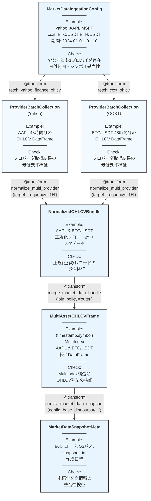

# algo-trade-app Market Data Ingestion 仕様

## 概要

Yahoo Finance（株式/ETF）と CCXT 経由の暗号資産 OHLCV データを共通フォーマットへ正規化し、下流の特徴量生成・学習パイプラインへ渡す Transform 群の仕様を定義する。中間の *Request* 型は設けず、`MarketDataIngestionConfig` から各プロバイダの取得・正規化を直接行う構成とし、型メタデータは `RegisteredType` で集約管理する。

## パイプライン構造



**凡例**:
- 🔵 **ノード**: RegisteredType として宣言された型 + Example (データ概要) + Check (検証目的)
- 🟢 **エッジ**: @transform 関数（パラメータ付き、型ヒントのみでメタデータ自動補完）
- パイプライン: 左から右へデータが流れる
- **重要**: transformer の実装では型ヒントのみを記述し、Example/Check は RegisteredType から自動補完される
- **Mermaid記法**: Example欄はサンプルデータの概要（複雑な場合）または具体値、Check欄は検証目的を記述

## 作成する型定義 (新規 - types.py)

```python
# types.py
from typing import List, Dict, Optional
from typing_extensions import TypedDict
from enum import StrEnum
import pandas as pd

class MarketDataProvider(StrEnum):
    """市場データプロバイダ識別子。"""

    YAHOO = "yahoo"
    CCXT = "ccxt"


class CCXTExchange(StrEnum):
    """CCXT で利用する取引所識別子。"""

    BINANCE = "binance"
    BYBIT = "bybit"
    KRAKEN = "kraken"


class YahooFinanceConfig(TypedDict):
    """Yahoo Finance データ取得設定。"""

    tickers: List[str]       # 例: ["AAPL", "MSFT"]
    start_date: str          # ISO8601 (YYYY-MM-DD)
    end_date: str            # ISO8601 (YYYY-MM-DD)
    frequency: Frequency     # 最小粒度: 1日 (Yahoo Finance の制約)
    use_adjusted_close: bool


class CCXTConfig(TypedDict):
    """CCXT データ取得設定。"""

    symbols: List[str]       # 例: ["BTC/USDT", "ETH/USDT"]
    start_date: str          # ISO8601 (YYYY-MM-DD)
    end_date: str            # ISO8601 (YYYY-MM-DD)
    frequency: Frequency     # 最小粒度: 1分 (取引所による)
    exchange: CCXTExchange
    rate_limit_ms: int       # レート制限 (ミリ秒)


class MarketDataIngestionConfig(TypedDict, total=False):
    """プロバイダ横断の取得条件（使用するプロバイダのみ指定）。"""

    yahoo: YahooFinanceConfig     # オプショナル
    ccxt: CCXTConfig              # オプショナル


class ProviderOHLCVBatch(TypedDict):
    """単一シンボルの取得結果とメタ情報。"""

    provider: MarketDataProvider
    symbol: str
    frame: pd.DataFrame      # 各行は FXDataSchema (OHLCVSchema) に準拠
    frequency: Frequency


class ProviderBatchCollection(TypedDict):
    """特定プロバイダの一括取得結果。"""

    provider: MarketDataProvider
    batches: List[ProviderOHLCVBatch]


class NormalizedOHLCVBundle(TypedDict):
    """正規化済み OHLCV データと メタデータ。

    frame: 正規化済み DataFrame
        - 列: timestamp (DatetimeIndex), provider, symbol, open, high, low, close, volume
        - provider 列は MarketDataProvider enum の文字列表現
    metadata: リサンプリング設定などのメタ情報
    """

    frame: pd.DataFrame      # 列: timestamp, provider, symbol, open, high, low, close, volume
    metadata: Dict[str, str]


class MultiAssetOHLCVFrame(TypedDict):
    """MultiIndex DataFrame をラップした構造。"""

    frame: pd.DataFrame      # index=(timestamp, symbol), 列は FXDataSchema (OHLCVSchema) 準拠
    symbols: List[str]
    providers: List[str]


class MarketDataSnapshotMeta(TypedDict):
    """永続化済みスナップショットのメタ情報。

    注: この型は persist_market_data_snapshot の出力として、
    スナップショットの記録・追跡・監査に使用される。
    データ読み込み時は storage_path を直接 load_market_data に渡す。
    """

    snapshot_id: str
    record_count: int
    storage_path: str
    created_at: str          # ISO8601 (UTC)

# RegisteredType で型メタデータを一元管理
MarketDataProviderReg = (
    RegisteredType(MarketDataProvider)
    .with_example(MarketDataProvider.YAHOO, "yahoo_provider")
    .with_example(MarketDataProvider.CCXT, "ccxt_provider")
)

CCXTExchangeReg = (
    RegisteredType(CCXTExchange)
    .with_example(CCXTExchange.BINANCE, "binance_exchange")
    .with_example(CCXTExchange.BYBIT, "bybit_exchange")
    .with_example(CCXTExchange.KRAKEN, "kraken_exchange")
)

YahooFinanceConfigReg: RegisteredType[YahooFinanceConfig] = (
    RegisteredType(YahooFinanceConfig)
    .with_example(gen_yahoo_only_config()["yahoo"], "yahoo_config_example")
    .with_check(check_ingestion_config)  # type: ignore[arg-type]
)

CCXTConfigReg: RegisteredType[CCXTConfig] = (
    RegisteredType(CCXTConfig)
    .with_example(gen_ccxt_only_config()["ccxt"], "ccxt_config_example")
    .with_check(check_ingestion_config)  # type: ignore[arg-type]
)

MarketDataIngestionConfigReg: RegisteredType[MarketDataIngestionConfig] = (
    RegisteredType(MarketDataIngestionConfig)
    .with_example(gen_ingestion_config(), "mixed_ingestion_config")
    .with_example(gen_yahoo_only_config(), "yahoo_only_config")
    .with_example(gen_ccxt_only_config(), "ccxt_only_config")
    .with_example(gen_mixed_frequency_config(), "mixed_frequency_config")
    .with_check(check_ingestion_config)  # type: ignore[arg-type]
)

ProviderBatchCollectionReg: RegisteredType[ProviderBatchCollection] = (
    RegisteredType(ProviderBatchCollection)
    .with_example(gen_yahoo_batch_collection(), "yahoo_batch_collection")
    .with_example(gen_ccxt_batch_collection(), "ccxt_batch_collection")
    .with_check(check_batch_collection)  # type: ignore[arg-type]
)

NormalizedOHLCVBundleReg: RegisteredType[NormalizedOHLCVBundle] = (
    RegisteredType(NormalizedOHLCVBundle)
    .with_example(gen_normalized_bundle(), "normalized_bundle")
    .with_check(check_normalized_bundle)  # type: ignore[arg-type]
)

MultiAssetOHLCVFrameReg: RegisteredType[MultiAssetOHLCVFrame] = (
    RegisteredType(MultiAssetOHLCVFrame)
    .with_example(gen_multiasset_frame(), "multiasset_frame")
    .with_check(check_multiasset_frame)  # type: ignore[arg-type]
)

MarketDataSnapshotMetaReg: RegisteredType[MarketDataSnapshotMeta] = (
    RegisteredType(MarketDataSnapshotMeta)
    .with_example(gen_snapshot_meta(), "snapshot_meta")
    .with_check(check_snapshot_meta)  # type: ignore[arg-type]
)
```

## 作成するExample (新規 - generators.py)

```python
def gen_ingestion_config() -> MarketDataIngestionConfig:
    """両方のプロバイダを使用する例。"""
    return {
        "yahoo": {
            "tickers": ["AAPL", "MSFT"],
            "start_date": "2024-01-01",
            "end_date": "2024-01-10",
            "frequency": Frequency.HOUR_1,
            "use_adjusted_close": True,
        },
        "ccxt": {
            "symbols": ["BTC/USDT", "ETH/USDT"],
            "start_date": "2024-01-01",
            "end_date": "2024-01-10",
            "frequency": Frequency.HOUR_1,
            "exchange": CCXTExchange.BINANCE,
            "rate_limit_ms": 1000,
        },
    }


def gen_yahoo_only_config() -> MarketDataIngestionConfig:
    """Yahoo Finance のみを使用する例（日足データ）。"""
    return {
        "yahoo": {
            "tickers": ["AAPL", "MSFT", "GOOGL"],
            "start_date": "2024-01-01",
            "end_date": "2024-01-10",
            "frequency": Frequency.DAY_1,  # Yahoo Finance は日足が最小粒度
            "use_adjusted_close": True,
        },
    }


def gen_ccxt_only_config() -> MarketDataIngestionConfig:
    """CCXT のみを使用する例（分足データ）。"""
    return {
        "ccxt": {
            "symbols": ["BTC/USDT", "ETH/USDT"],
            "start_date": "2024-01-01",
            "end_date": "2024-01-10",
            "frequency": Frequency.MIN_15,  # CCXT は分足から取得可能
            "exchange": CCXTExchange.BINANCE,
            "rate_limit_ms": 1000,
        },
    }


def gen_mixed_frequency_config() -> MarketDataIngestionConfig:
    """異なる粒度のデータソースを混在させる例。"""
    return {
        "yahoo": {
            "tickers": ["AAPL", "MSFT"],
            "start_date": "2024-01-01",
            "end_date": "2024-01-10",
            "frequency": Frequency.DAY_1,  # 日足
            "use_adjusted_close": True,
        },
        "ccxt": {
            "symbols": ["BTC/USDT", "ETH/USDT"],
            "start_date": "2024-01-01",
            "end_date": "2024-01-10",
            "frequency": Frequency.HOUR_1,  # 時間足
            "exchange": CCXTExchange.BINANCE,
            "rate_limit_ms": 1000,
        },
    }


def gen_yahoo_batch_collection() -> ProviderBatchCollection:
    frame = gen_sample_ohlcv(n=48, start_price=150.0, seed=7)
    frame.reset_index(inplace=True)
    batch = {
        "provider": MarketDataProvider.YAHOO,
        "symbol": "AAPL",
        "frame": frame,
        "frequency": Frequency.HOUR_1,
    }
    return {"provider": MarketDataProvider.YAHOO, "batches": [batch]}


def gen_ccxt_batch_collection() -> ProviderBatchCollection:
    frame = gen_sample_ohlcv(n=48, start_price=45000.0, seed=11)
    frame.reset_index(inplace=True)
    batch = {
        "provider": MarketDataProvider.CCXT,
        "symbol": "BTC/USDT",
        "frame": frame,
        "frequency": Frequency.HOUR_1,
    }
    return {"provider": MarketDataProvider.CCXT, "batches": [batch]}


def gen_normalized_bundle() -> NormalizedOHLCVBundle:
    data = [
        {
            "timestamp": pd.Timestamp("2024-01-01T00:00:00Z"),
            "provider": MarketDataProvider.YAHOO.value,
            "symbol": "AAPL",
            "open": 150.0,
            "high": 151.0,
            "low": 149.5,
            "close": 150.5,
            "volume": 1_200_000.0,
        },
        {
            "timestamp": pd.Timestamp("2024-01-01T00:00:00Z"),
            "provider": MarketDataProvider.CCXT.value,
            "symbol": "BTC/USDT",
            "open": 45000.0,
            "high": 45200.0,
            "low": 44850.0,
            "close": 45120.0,
            "volume": 320.5,
        },
    ]
    frame = pd.DataFrame(data)
    return {
        "frame": frame,
        "metadata": {"target_frequency": "1H", "source_count": "2"},
    }


def gen_multiasset_frame() -> MultiAssetOHLCVFrame:
    normalized = gen_normalized_bundle()
    frame = normalized["frame"].copy()
    frame.set_index(["timestamp", "symbol"], inplace=True)
    return {
        "frame": frame,
        "symbols": ["AAPL", "BTC/USDT"],
        "providers": [MarketDataProvider.YAHOO.value, MarketDataProvider.CCXT.value],
    }


def gen_snapshot_meta() -> MarketDataSnapshotMeta:
    return {
        "snapshot_id": "snapshot_a3f2c8b1e4d6f9a0_2024-01-01_2024-01-10",
        "record_count": 96,
        "storage_path": "output/data/snapshots/a3f2c8b1e4d6f9a0/2024-01-01_2024-01-10/market.parquet",
        "created_at": "2024-01-10T00:15:00Z",
    }
```

## 作成するCheck関数 (新規 - checks.py)

```python
def check_ingestion_config(config: MarketDataIngestionConfig) -> None:
    """日付範囲、対象シンボル、周波数設定の妥当性を検証。"""
    # 実装省略（既存）

def check_batch_collection(collection: ProviderBatchCollection) -> None:
    """各プロバイダの取得結果が最低要件を満たすか検証。"""
    # 実装省略（既存）

def check_provider_batch(batch: ProviderOHLCVBatch) -> None:
    """個別バッチの DataFrame 構造を検証。"""
    # 実装省略（既存）

def check_normalized_bundle(bundle: NormalizedOHLCVBundle) -> None:
    """正規化済み DataFrame の一貫性を検証。"""
    # 実装省略（既存）

def check_multiasset_frame(frame_info: MultiAssetOHLCVFrame) -> None:
    """MultiIndex DataFrame が想定構造を満たすか検証。"""
    # 実装省略（既存）

def check_snapshot_meta(meta: MarketDataSnapshotMeta) -> None:
    """永続化メタ情報の整合性を検証。"""
    # 実装省略（既存）
```

## 作成するTransformer

### 1. fetch_yahoo_finance_ohlcv

```python
from xform_core.transforms_core import transform

@transform
def fetch_yahoo_finance_ohlcv(
    config: YahooFinanceConfig,
) -> ProviderBatchCollection:
    """yfinance から ticker 群を取得し、ProviderBatchCollection として返す。"""
    # 仮実装: 実際のAPI呼び出し部分は省略し、Exampleデータを返す
    tickers = config["tickers"]
    # 最初のティッカーのみ処理
    symbol = tickers[0]
    frame = gen_sample_ohlcv(n=48, start_price=150.0, seed=7)
    frame.reset_index(inplace=True)
    batch = {
        "provider": MarketDataProvider.YAHOO,
        "symbol": symbol,
        "frame": frame,
        "frequency": config["frequency"],
    }
    return {"provider": MarketDataProvider.YAHOO, "batches": [batch]}
```

**Auto-Completion**: 入出力の型が RegisteredType で宣言されているため、Example と Check は自動的に補完される

### 2. fetch_ccxt_ohlcv

```python
@transform
def fetch_ccxt_ohlcv(
    config: CCXTConfig,
) -> ProviderBatchCollection:
    """CCXT 取引所から暗号資産の OHLCV を取得。"""
    # 仮実装: 実際のAPI呼び出し部分は省略し、Exampleデータを返す
    symbols = config["symbols"]
    # 最初のシンボルのみ処理
    symbol = symbols[0]
    frame = gen_sample_ohlcv(n=48, start_price=45000.0, seed=11)
    frame.reset_index(inplace=True)
    batch = {
        "provider": MarketDataProvider.CCXT,
        "symbol": symbol,
        "frame": frame,
        "frequency": config["frequency"],
    }
    return {"provider": MarketDataProvider.CCXT, "batches": [batch]}
```

**Auto-Completion**: 入出力の型が RegisteredType で宣言されているため、Example と Check は自動的に補完される

### 3. normalize_multi_provider

```python
@transform
def normalize_multi_provider(
    *provider_batches: ProviderBatchCollection,
    target_frequency: Frequency = Frequency.HOUR_1,
    resample_method: str = "forward_fill",  # "forward_fill" or "upsample"
) -> NormalizedOHLCVBundle:
    """複数プロバイダの取得結果を統一スキーマへ変換。

    可変長引数で複数のプロバイダバッチを受け取り、内部で集約してから正規化する。
    provider と symbol の組が重複しないことを検証。
    """
    # 仮実装: Exampleデータを返す
    from algo_trade_dtype.generators import gen_normalized_bundle
    return gen_normalized_bundle()
```

**Auto-Completion**: 入出力の型が RegisteredType で宣言されているため、Example と Check は自動的に補完される

### 4. merge_market_data_bundle

```python
@transform
def merge_market_data_bundle(
    bundle: NormalizedOHLCVBundle,
    *,
    join_policy: str = "outer",
) -> MultiAssetOHLCVFrame:
    """正規化 DataFrame を MultiIndex DataFrame に変換。"""
    # 仮実装: Exampleデータを返す
    from algo_trade_dtype.generators import gen_multiasset_frame
    return gen_multiasset_frame()
```

**Auto-Completion**: 入出力の型が RegisteredType で宣言されているため、Example と Check は自動的に補完される

### 5. persist_market_data_snapshot

```python
@transform
def persist_market_data_snapshot(
    multiasset_frame: MultiAssetOHLCVFrame,
    config: MarketDataIngestionConfig,
    *,
    base_dir: str = "output/data/snapshots",
) -> MarketDataSnapshotMeta:
    """Parquet へ書き出し、config から一意のパスを自動生成。"""
    # 仮実装: Exampleデータを返す
    from algo_trade_dtype.generators import gen_snapshot_meta
    return gen_snapshot_meta()
```

**Auto-Completion**: 入出力の型が RegisteredType で宣言されているため、Example と Check は自動的に補完される

### 6. load_market_data

```python
@transform
def load_market_data(
    storage_path: str,
    *,
    format: str = "auto",
) -> MultiAssetOHLCVFrame:
    """ファイルパスから市場データを読み込み。"""
    # 仮実装: Exampleデータを返す
    from algo_trade_dtype.generators import gen_multiasset_frame
    return gen_multiasset_frame()
```

**Auto-Completion**: 入出力の型が RegisteredType で宣言されているため、Example と Check は自動的に補完される

## Audit実行

```bash
uv run python -m xform_auditor apps/algo-trade-app/algo_trade_app/market_data.py
```

**期待結果**: 6 transforms, 6 OK, 0 VIOLATION, 0 ERROR, 0 MISSING