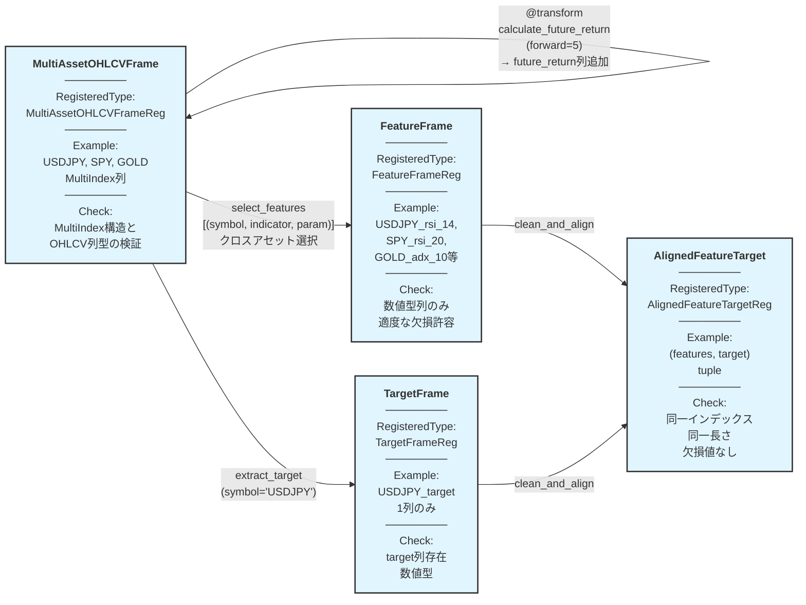

# algo-trade Phase 2: 特徴量加工仕様

## 概要

Market Data Ingestion の出力である MultiAssetOHLCVFrame から、機械学習用の特徴量とターゲット変数を生成する。

**重要な設計方針**:
- MultiAssetOHLCVFrame: OHLCV基本列 + テクニカルインジケータ列の混在を許容
  - 列構造: MultiIndex[(symbol, column_name)]
  - インジケータ列名にパラメータを含める（例: "rsi_14", "rsi_4", "adx_20"）
  - 同一インジケータを異なるパラメータで複数生成可能（USDJPY_rsi_14, USDJPY_rsi_4など）
- FeatureFrame: 指定されたインジケータ列のみ（クロスアセット特徴量選択対応）
  - **推奨**: 3-tuple形式 `(symbol, indicator, param)` で指定
  - 型安全性と動的パラメータ探索のため
- TargetFrame: 指定された資産のターゲット変数のみ
  - **推奨**: `indicator + **params` 形式で指定
- AlignedFeatureTarget: 欠損値処理済みの整列データ（機械学習用）

## パイプライン構造



**凡例**:
- 🔵 **ノード**: RegisteredType として宣言された型 + Example + Check
- 🟢 **エッジ**: @transform 関数（パラメータ付き、型ヒントのみでメタデータ自動補完）
- パイプライン: 左から右へデータが流れる
- **重要**:
  - transformer の実装では型ヒントのみを記述し、Example/Check は RegisteredType から自動補完される
  - 同一インジケータを異なるパラメータで複数回呼び出すことで、複数の列（rsi_14, rsi_4等）を生成
  - インジケータ列名にはパラメータを含める（再現性とキャッシュのため）
  - **特徴量選択は3-tuple形式を推奨**: `(symbol, indicator, param)` で型安全性と可読性を確保

**使用例シナリオ**:
```python
# USDJPYを予測対象とし、クロスアセット特徴量を使用（推奨: 3-tuple形式）
feature_specs = [
    ("USDJPY", "rsi", 14),
    ("USDJPY", "adx", 14),
    ("SPY", "rsi", 20),
    ("GOLD", "adx", 10),
]
features = select_features(ohlcv_with_indicators, feature_specs)
target = extract_target(ohlcv_with_indicators, symbol="USDJPY", indicator="future_return", forward=5)

# ショートハンド形式（2-tuple）も利用可能
feature_specs_shorthand = [
    ("USDJPY", "rsi_14"),
    ("SPY", "rsi_20"),
]
features = select_features(ohlcv_with_indicators, feature_specs_shorthand)
target = extract_target(ohlcv_with_indicators, symbol="USDJPY", column="future_return_5")
```

## 作成する型定義 (新規 - types.py)

### FeatureFrame
```python
# types.py
from typing import TypeAlias
import pandas as pd
from xform_core.types import RegisteredType

FeatureFrame: TypeAlias = pd.DataFrame
"""特徴量DataFrame（数値型列のみ、インジケータ計算による適度な欠損を許容）

Structure:
- Index: DatetimeIndex (timestamp)
- Columns: Flattened "{symbol}_{indicator}" format
  - Examples: "USDJPY_rsi_14", "SPY_rsi_20", "GOLD_adx_10"
  - Selected from MultiAssetOHLCVFrame via select_features()

Note: Column names include both symbol and parameter for cross-asset modeling.
"""

FeatureFrameReg: RegisteredType[FeatureFrame] = (
    RegisteredType(FeatureFrame)
    .with_example(gen_feature_frame(), "feature_frame_example")
    .with_check(check_feature_frame)
)
```

### TargetFrame
```python
TargetFrame: TypeAlias = pd.DataFrame
"""ターゲットDataFrame（target列のみ、数値型）

Structure:
- Index: DatetimeIndex (timestamp)
- Columns: Single "target" column
  - Extracted from specific asset via extract_target()
  - Example: USDJPY's future_return_5 → "target" column
"""

TargetFrameReg: RegisteredType[TargetFrame] = (
    RegisteredType(TargetFrame)
    .with_example(gen_target_frame(), "target_frame_example")
    .with_check(check_target)  # 既存のcheck関数を再利用
)
```

### AlignedFeatureTarget
```python
from typing import Tuple

AlignedFeatureTarget: TypeAlias = Tuple[pd.DataFrame, pd.DataFrame]
"""整列済み特徴量とターゲットのタプル（インデックス一致、欠損値なし）"""

AlignedFeatureTargetReg: RegisteredType[AlignedFeatureTarget] = (
    RegisteredType(AlignedFeatureTarget)
    .with_example(gen_aligned_feature_target(), "aligned_feature_target")
    .with_check(check_aligned_data)  # 既存のcheck関数を再利用
)
```

## 作成するExample (新規 - generators.py)

```python
def gen_feature_frame() -> pd.DataFrame:
    """特徴量DataFrameのExample生成（クロスアセット特徴量シナリオ）

    Generated by select_features with 3-tuple format:
    [("USDJPY", "rsi", 14), ("USDJPY", "adx", 14),
     ("SPY", "rsi", 20), ("GOLD", "adx", 10)]
    """
    data = {
        "USDJPY_rsi_14": [45.0, 52.0, 48.0],
        "USDJPY_adx_14": [25.0, 28.0, 22.0],
        "SPY_rsi_20": [55.0, 58.0, 54.0],
        "GOLD_adx_10": [30.0, 32.0, 28.0],
    }
    index = pd.date_range("2024-01-01", periods=3, freq="1H")
    return pd.DataFrame(data, index=index)


def gen_target_frame() -> pd.DataFrame:
    """ターゲットDataFrameのExample生成

    Generated by extract_target with recommended format:
    extract_target(df, symbol="USDJPY", indicator="future_return", forward=5)
    """
    data = {"target": [0.005, -0.002, 0.008]}
    index = pd.date_range("2024-01-01", periods=3, freq="1H")
    return pd.DataFrame(data, index=index)


def gen_aligned_feature_target() -> Tuple[pd.DataFrame, pd.DataFrame]:
    """整列済み特徴量とターゲットのExample生成"""
    features = gen_feature_frame()
    target = gen_target_frame()
    return (features, target)
```

## 作成するCheck関数 (新規 - checks.py)

```python
def check_feature_frame(df: pd.DataFrame) -> None:
    """特徴量DataFrameの検証（数値型列のみ、欠損値は許容）

    インジケータ計算（RSI、移動平均等）では初期期間に欠損が発生するため、
    欠損値チェックは clean_and_align 後の AlignedFeatureTarget で行う。
    """
    if not isinstance(df, pd.DataFrame):
        raise TypeError(f"Expected pd.DataFrame, got {type(df)}")

    if df.empty:
        return

    # 全列が数値型であることを確認
    for col in df.columns:
        if not pd.api.types.is_numeric_dtype(df[col]):
            raise TypeError(f"Column '{col}' must be numeric")
```

**注**: 欠損値チェックは `check_aligned_data` で実施（clean_and_align後に厳格チェック）

## 作成するTransformer

### 1. resample_ohlcv (既存)

```python
@transform
def resample_ohlcv(
    df: pd.DataFrame,
    *,
    freq: str = "1h",
) -> pd.DataFrame:
    """Resample OHLCV DataFrame to specified frequency."""
```

**Parameters**: `freq` - リサンプリング周波数（デフォルト "1h"）

**Logic**: OHLCV列を指定周波数でリサンプリング（first/max/min/last/sum）

**Auto-Completion**: 既存の個別Check定義を使用

---

### 2. calculate_rsi (既存 - 列名生成ルール追加)

```python
@transform
def calculate_rsi(
    df: pd.DataFrame,
    *,
    period: int = 14,
) -> pd.DataFrame:
    """Calculate RSI (Relative Strength Index) indicator.

    Adds a new column named "rsi_{period}" to the DataFrame.
    Multiple calls with different periods create separate columns.
    """
```

**Parameters**: `period` - RSI計算期間（デフォルト 14）

**Column Name**: `"rsi_{period}"` (例: period=14 → "rsi_14", period=4 → "rsi_4")

**Logic**:
- 終値の変化率からRSI値を計算
- 新しい列 `"rsi_{period}"` を MultiAssetOHLCVFrame に追加
- 既存の列は保持される（累積的に列が追加される）

**Auto-Completion**: 既存の個別Check定義を使用

---

### 3. calculate_adx (既存 - 列名生成ルール追加)

```python
@transform
def calculate_adx(
    df: pd.DataFrame,
    *,
    period: int = 14,
) -> pd.DataFrame:
    """Calculate ADX (Average Directional Index) indicator.

    Adds a new column named "adx_{period}" to the DataFrame.
    Multiple calls with different periods create separate columns.
    """
```

**Parameters**: `period` - ADX計算期間（デフォルト 14）

**Column Name**: `"adx_{period}"` (例: period=14 → "adx_14", period=10 → "adx_10")

**Logic**:
- 高値・安値・終値からADX値を計算
- 新しい列 `"adx_{period}"` を MultiAssetOHLCVFrame に追加
- 既存の列は保持される（累積的に列が追加される）

**Auto-Completion**: 既存の個別Check定義を使用

---

### 4. calculate_recent_return (既存 - 列名生成ルール追加)

```python
@transform
def calculate_recent_return(
    df: pd.DataFrame,
    *,
    lookback: int = 5,
) -> pd.DataFrame:
    """Calculate recent return over lookback periods.

    Adds a new column named "recent_return_{lookback}" to the DataFrame.
    Multiple calls with different lookbacks create separate columns.
    """
```

**Parameters**: `lookback` - ルックバック期間（デフォルト 5）

**Column Name**: `"recent_return_{lookback}"` (例: lookback=5 → "recent_return_5")

**Logic**:
- 終値の過去N期間リターンを計算
- 新しい列 `"recent_return_{lookback}"` を MultiAssetOHLCVFrame に追加
- 既存の列は保持される（累積的に列が追加される）

**Auto-Completion**: 既存の個別Check定義を使用

---

### 5. calculate_volatility (既存 - 列名生成ルール追加)

```python
@transform
def calculate_volatility(
    df: pd.DataFrame,
    *,
    window: int = 20,
) -> pd.DataFrame:
    """Calculate rolling volatility (standard deviation of returns).

    Adds a new column named "volatility_{window}" to the DataFrame.
    Multiple calls with different windows create separate columns.
    """
```

**Parameters**: `window` - ローリング窓サイズ（デフォルト 20）

**Column Name**: `"volatility_{window}"` (例: window=20 → "volatility_20")

**Logic**:
- リターンの標準偏差を計算
- 新しい列 `"volatility_{window}"` を MultiAssetOHLCVFrame に追加
- 既存の列は保持される（累積的に列が追加される）

**Auto-Completion**: 既存の個別Check定義を使用

---

### 6. calculate_future_return (既存 - 列名生成ルール追加)

```python
@transform
def calculate_future_return(
    df: pd.DataFrame,
    *,
    forward: int = 5,
    convert_type: ConvertType = ConvertType.RETURN,
) -> pd.DataFrame:
    """Calculate future return or direction as target variable.

    Adds a new column named "future_return_{forward}" or
    "future_direction_{forward}" depending on convert_type.
    Multiple calls with different parameters create separate columns.
    """
```

**Parameters**:
- `forward` - 予測期間（デフォルト 5）
- `convert_type` - 変換タイプ（RETURN/LOG_RETURN/DIRECTION）

**Column Name**:
- `convert_type=RETURN`: `"future_return_{forward}"` (例: forward=5 → "future_return_5")
- `convert_type=LOG_RETURN`: `"future_log_return_{forward}"`
- `convert_type=DIRECTION`: `"future_direction_{forward}"`

**Logic**:
- 未来の終値から目標変数を計算
- 新しい列を MultiAssetOHLCVFrame に追加
- 既存の列は保持される（累積的に列が追加される）

**Auto-Completion**: 既存の個別Check定義を使用

---

### 7. select_features (新規ヘルパー関数 - @transformなし)

```python
def select_features(
    df: pd.DataFrame,
    feature_specs: list[tuple[str, str] | tuple[str, str, int] | tuple[str, str, int, ...]],
) -> pd.DataFrame:
    """Select specific indicators from specific assets for cross-asset modeling.

    This function enables flexible feature selection across multiple assets,
    preventing look-ahead bias by excluding price/volume data and allowing
    fine-grained control over which indicators to use for each asset.

    Helper function for pipeline composition - not a @transform function.

    Args:
        df: MultiAssetOHLCVFrame with MultiIndex[(symbol, column)] structure
        feature_specs: List of feature specifications in multiple formats:
            - 3-tuple (recommended): (symbol, indicator, param)
              Examples: ("USDJPY", "rsi", 14), ("SPY", "adx", 10)
            - 2-tuple (shorthand): (symbol, "indicator_param")
              Examples: ("USDJPY", "rsi_14"), ("SPY", "adx_10")
            - N-tuple (multi-param): (symbol, indicator, param1, param2, ...)
              Example: ("USDJPY", "bollinger", 20, 2)

    Returns:
        FeatureFrame with only selected columns, flattened to
        "{symbol}_{indicator}_{params}" column names for ML compatibility

    Examples:
        >>> # Recommended: 3-tuple format with numeric parameters
        >>> features = select_features(df, [
        ...     ("USDJPY", "rsi", 14),
        ...     ("USDJPY", "adx", 14),
        ...     ("SPY", "rsi", 20),
        ...     ("GOLD", "adx", 10),
        ... ])
        >>> # Result columns: ["USDJPY_rsi_14", "USDJPY_adx_14", "SPY_rsi_20", "GOLD_adx_10"]

        >>> # Shorthand: 2-tuple format
        >>> features = select_features(df, [
        ...     ("USDJPY", "rsi_14"),
        ...     ("SPY", "rsi_20"),
        ... ])

        >>> # Dynamic parameter exploration (3-tuple format is natural)
        >>> for period in [4, 8, 14, 20]:
        ...     specs = [("USDJPY", "rsi", period)]
        ...     features = select_features(df, specs)
    """
    if df.empty:
        return pd.DataFrame()

    selected_data = {}
    for spec in feature_specs:
        if len(spec) == 2:
            # Shorthand: ("USDJPY", "rsi_14")
            symbol, indicator_with_param = spec
            col_name = f"{symbol}_{indicator_with_param}"
            df_col_name = indicator_with_param
        else:
            # Recommended: ("USDJPY", "rsi", 14) or ("USDJPY", "bollinger", 20, 2)
            symbol, indicator, *params = spec
            param_str = "_".join(map(str, params))
            df_col_name = f"{indicator}_{param_str}"
            col_name = f"{symbol}_{df_col_name}"

        selected_data[col_name] = df[(symbol, df_col_name)]

    return pd.DataFrame(selected_data, index=df.index)
```

**注**: この関数は技術的な列選択処理でありLook-ahead Bias防止とクロスアセット特徴量選択が目的のため、@transform を適用しない

**推奨事項**: 3-tuple形式を使用することで、型安全性、可読性、動的パラメータ探索が向上します

---

### 8. extract_target (新規ヘルパー関数 - @transformなし)

```python
def extract_target(
    df: pd.DataFrame,
    symbol: str,
    indicator: str | None = None,
    column: str | None = None,
    **params,
) -> pd.DataFrame:
    """Extract target variable for a specific asset.

    This function selects the prediction target from a single asset,
    enabling cross-asset feature scenarios where features come from
    multiple assets but the target is from one specific asset.

    Helper function for pipeline composition - not a @transform function.

    Args:
        df: MultiAssetOHLCVFrame with MultiIndex[(symbol, column)] structure
        symbol: Symbol to use as prediction target (e.g., "USDJPY")
        indicator: Indicator name (e.g., "future_return") - used with params
        column: Full column name (e.g., "future_return_5") - shorthand format
        **params: Indicator parameters (e.g., forward=5)

    Returns:
        TargetFrame with single column named "target"

    Examples:
        >>> # Recommended: indicator + params format
        >>> target = extract_target(df, symbol="USDJPY", indicator="future_return", forward=5)
        >>> # Result: DataFrame with single "target" column

        >>> # Shorthand: column format
        >>> target = extract_target(df, symbol="USDJPY", column="future_return_5")

        >>> # Multi-parameter example
        >>> target = extract_target(df, symbol="USDJPY", indicator="bollinger_upper", window=20, std_dev=2)
    """
    if df.empty:
        return pd.DataFrame()

    if column is not None:
        # Shorthand format: column="future_return_5"
        df_col_name = column
    elif indicator is not None:
        # Recommended format: indicator="future_return", forward=5
        param_str = "_".join(str(v) for v in params.values())
        df_col_name = f"{indicator}_{param_str}" if param_str else indicator
    else:
        raise ValueError("Either 'indicator' or 'column' must be specified")

    target_series = df[(symbol, df_col_name)]
    return pd.DataFrame({"target": target_series}, index=df.index)
```

**注**: この関数は技術的な列選択処理のため、@transform を適用しない

**推奨事項**: `indicator` + `**params` 形式を使用することで、transformer関数との一貫性が向上します

---

### 9. clean_and_align (既存ヘルパー関数 - @transformなし)

```python
def clean_and_align(
    features: pd.DataFrame,
    target: pd.DataFrame,
) -> Tuple[pd.DataFrame, pd.DataFrame]:
    """Align features and target DataFrames by removing NaN rows.

    Helper function for technical preprocessing - not a @transform function.
    """
```

**Logic**: 特徴量とターゲットを結合してNaN行を削除し、再分割

**注**: この関数は技術的な前処理のため、@transform を適用しない（既存実装通り）

## 既存実装の問題点と修正提案

### 問題1: RegisteredType が使われていない

**現状**: 型定義はあるが、RegisteredType での宣言がない

**修正案**: types.py に以下を追加
```python
from xform_core.types import RegisteredType

# 既存型のRegisteredType宣言を追加
MultiAssetOHLCVFrame: TypeAlias = pd.DataFrame
"""Multi-asset OHLCV DataFrame with optional technical indicators.

Structure:
- Index: DatetimeIndex (timestamp)
- Columns: MultiIndex[(symbol, column_name)]
  - Level 0 (symbol): "USDJPY", "SPY", "GOLD", etc.
  - Level 1 (column_name): "open", "high", "low", "close", "volume",
                           "rsi_14", "rsi_4", "adx_14", "adx_10",
                           "future_return_5", etc.

Column Naming Convention:
- Base columns: "open", "high", "low", "close", "volume"
- Indicator columns with parameters: "{indicator}_{param}"
  - Examples: "rsi_14", "rsi_4", "adx_20", "volatility_20", "future_return_5"
  - Parameters are included in column names for reproducibility and caching

Example Structure:
```
                    USDJPY                          SPY              GOLD
                    open  close  rsi_14  rsi_4  adx_14  close  rsi_20  close  adx_10
2024-01-01 00:00   150.5  150.6   45.2   52.1    25.3   400.1   48.5   1850    28.2
2024-01-01 01:00   150.7  150.8   46.1   51.8    26.1   401.2   49.1   1852    27.8
```

Note: The "V" in OHLCV refers to Volume, not Volatility.
Volatility is an optional derived indicator column.
"""

MultiAssetOHLCVFrameReg: RegisteredType[MultiAssetOHLCVFrame] = (
    RegisteredType(MultiAssetOHLCVFrame)
    .with_example(gen_multiasset_frame(), "multiasset_frame")
    .with_check(check_multiasset_frame)
)

# 新規型のRegisteredType宣言
FeatureFrame: TypeAlias = pd.DataFrame
"""特徴量DataFrame（数値型列のみ、インジケータ計算による適度な欠損を許容）

Structure:
- Index: DatetimeIndex (timestamp)
- Columns: Flattened "{symbol}_{indicator}" format
  - Examples: "USDJPY_rsi_14", "SPY_rsi_20", "GOLD_adx_10"
  - Selected from MultiAssetOHLCVFrame via select_features()

Note: Column names include both symbol and parameter for cross-asset modeling.
"""

FeatureFrameReg: RegisteredType[pd.DataFrame] = (
    RegisteredType(pd.DataFrame)
    .with_example(gen_feature_frame(), "feature_frame")
    .with_check(check_feature_frame)
)

TargetFrame: TypeAlias = pd.DataFrame
"""ターゲットDataFrame（target列のみ、数値型）

Structure:
- Index: DatetimeIndex (timestamp)
- Columns: Single "target" column
  - Extracted from specific asset via extract_target()
  - Example: USDJPY's future_return_5 → "target" column
"""

TargetFrameReg: RegisteredType[pd.DataFrame] = (
    RegisteredType(pd.DataFrame)
    .with_example(gen_target_frame(), "target_frame")
    .with_check(check_target)
)

AlignedFeatureTargetReg: RegisteredType[Tuple[pd.DataFrame, pd.DataFrame]] = (
    RegisteredType(Tuple[pd.DataFrame, pd.DataFrame])
    .with_example(gen_aligned_feature_target(), "aligned_feature_target")
    .with_check(check_aligned_data)
)
```

### 問題2: transform関数で個別にCheckを記述

**現状**: transforms.py で各関数に `Annotated[..., Check["..."]]` を直接記述

**修正案**: RegisteredType で型レベルのCheckを定義し、transform側は型ヒントのみに簡素化
```python
# 現状（冗長）
@transform
def resample_ohlcv(
    df: pd.DataFrame,
    *,
    freq: str = "1h",
) -> Annotated[pd.DataFrame, Check("algo_trade_dtypes.checks.check_ohlcv")]:
    """..."""

# 修正後（簡潔）
@transform
def resample_ohlcv(
    df: OHLCVFrame,  # RegisteredType
    *,
    freq: str = "1h",
) -> OHLCVFrame:  # RegisteredType（Check自動補完）
    """..."""
```

### 問題3: クロスアセット特徴量選択への対応

**現状**: 特徴量選択が全インジケータ列を返すのみで、資産・インジケータを個別指定できない

**修正案**: 以下の2つのヘルパー関数を追加

1. `select_features(df, feature_specs)`: クロスアセット特徴量選択
   - **推奨**: 3-tuple形式 `(symbol, indicator, param)`
     - 例: `[("USDJPY", "rsi", 14), ("SPY", "rsi", 20), ("GOLD", "adx", 10)]`
     - 型安全性: パラメータが数値型として明示される
     - 動的探索: `for period in [4,8,14]: specs.append(("USDJPY", "rsi", period))`
   - **ショートハンド**: 2-tuple形式 `(symbol, "indicator_param")`
     - 例: `[("USDJPY", "rsi_14"), ("SPY", "rsi_20")]`

2. `extract_target(df, symbol, indicator, **params)`: 特定資産のターゲット抽出
   - **推奨**: `extract_target(df, symbol="USDJPY", indicator="future_return", forward=5)`
   - **ショートハンド**: `extract_target(df, symbol="USDJPY", column="future_return_5")`

**インジケータ列名規則**:
- パラメータを列名に含める: `"rsi_14"`, `"rsi_4"`, `"adx_10"`
- 理由: 再現性、キャッシュキー、複数パラメータでの同時使用

**3-tuple形式のメリット**:
- パラメータが数値型として扱われる（型安全性）
- transformer関数との一貫性（`calculate_rsi(df, period=14)` ↔ `("USDJPY", "rsi", 14)`）
- 動的パラメータ探索が自然（グリッドサーチ、最適化など）

### 問題4: clean_and_align に @transform が不適切に使われていない

**現状**: `clean_and_align` は技術的な前処理で、@transform が付いていない

**評価**: ✅ **正しい実装** - 技術的な前処理には @transform を適用しないのが適切

## Audit実行直前メモ

- 本ドキュメントの実装方針と現状コードの差異は「現状の実装との差分」節を参照。

## 現状の実装との差分

- `calculate_future_return` は `future_return_{forward}` 系の列名を生成せず、常に `"target"` 列へ書き込む実装になっている（`apps/algo-trade/algo_trade_transforms/transforms.py:338`）。そのため仕様で想定する `("USDJPY", "future_return", 5)` → `"USDJPY_future_return_5"` の列選択が行えない。
- `select_features` / `extract_target` / `clean_and_align` はヘルパー関数として利用する設計だが、現状は @transform が付与され DAG ノードとして扱われている（`apps/algo-trade/algo_trade_transforms/transforms.py:371`, `:415`, `:487`）。技術的ユーティリティまで Transform 化されており、仕様ガイドラインと乖離している。

## Audit実行

```bash
uv run python -m xform_auditor apps/algo-trade/algo_trade_transforms/transforms.py
```

**期待結果**: 6 transforms, 6 OK, 0 VIOLATION, 0 ERROR, 0 MISSING

**注**: 以下のヘルパー関数は @transform を持たないため、audit対象外
- select_features
- extract_target
- clean_and_align
