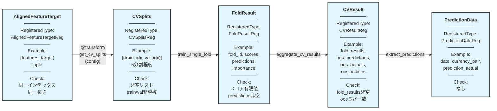

# algo-trade Phase 3: 学習・予測仕様

## 概要

特徴量とターゲットからクロスバリデーション分割を行い、モデル学習と予測を実施する。

## パイプライン構造



**凡例**:
- 🔵 **ノード**: RegisteredType として宣言された型 + Example + Check
- 🟢 **エッジ**: @transform 関数（パラメータ付き、型ヒントのみでメタデータ自動補完）
- パイプライン: 左から右へデータが流れる
- **重要**: transformer の実装では型ヒントのみを記述し、Example/Check は RegisteredType から自動補完される

## 作成する型定義 (既存 - types.py)

**Phase 3 では既存型のみを使用**（新規型定義は不要）

### TimeSeriesSplitConfig
```python
class TimeSeriesSplitConfig(TypedDict, total=False):
    """sklearn TimeSeriesSplit のクロスバリデーション設定。

    対応する sklearn パラメータ:
        n_splits: 分割数（デフォルト: 5）
        test_size: 各テストセットのサンプル数（固定、None の場合は自動計算）
        gap: train と test の間のギャップサンプル数（デフォルト: 0）

    参考: https://scikit-learn.org/stable/modules/generated/sklearn.model_selection.TimeSeriesSplit.html
    """

    n_splits: int
    test_size: int | None
    gap: int
```

### FoldResult
```python
class FoldResult(TypedDict):
    """Fold 単位の学習結果。"""

    fold_id: int
    train_indices: List[int]
    valid_indices: List[int]
    train_score: float
    valid_score: float
    predictions: List[float]
    feature_importance: Dict[str, float]
```

### CVResult
```python
class CVResult(TypedDict):
    """クロスバリデーション結果全体。

    注: fold 単位の平均スコアは参考値に過ぎない。
    本質的な評価は連結された OOS 系列全体（oos_predictions + oos_actuals）に対して行う。
    """

    fold_results: List[FoldResult]
    oos_predictions: List[float]  # 連結された OOS 予測値
    oos_actuals: List[float]      # 連結された OOS 実測値
    oos_indices: List[int]        # 連結された OOS インデックス
```

### PredictionData
```python
class PredictionData(TypedDict):
    """予測値と実績値を含むデータスキーマ。"""

    date: str
    currency_pair: str
    prediction: float
    actual_return: float
```

## RegisteredType宣言 (新規 - types.py)

```python
from xform_core.types import RegisteredType
from typing import List, Tuple

# CVSplits の型定義とRegisteredType宣言
CVSplits: TypeAlias = List[Tuple[List[int], List[int]]]

CVSplitsReg: RegisteredType[CVSplits] = (
    RegisteredType(CVSplits)
    .with_example(gen_cv_splits(), "cv_splits_example")
    .with_check(check_cv_splits)  # 既存check関数を再利用
)

FoldResultReg: RegisteredType[FoldResult] = (
    RegisteredType(FoldResult)
    .with_example(gen_fold_result(), "fold_result_example")
    .with_check(check_fold_result)  # 既存check関数を再利用
)

CVResultReg: RegisteredType[CVResult] = (
    RegisteredType(CVResult)
    .with_example(gen_cv_result(), "cv_result_example")
    .with_check(check_cv_result)  # 既存check関数を再利用
)

PredictionDataReg: RegisteredType[List[PredictionData]] = (
    RegisteredType(List[PredictionData])
    .with_example(gen_prediction_data(), "prediction_data_example")
    # Check関数はなし（下流で check_ranked_predictions が実行される）
)
```

## 作成するExample (新規 - generators.py)

```python
def gen_cv_splits() -> List[Tuple[List[int], List[int]]]:
    """CV分割のExample生成（シンプルな具体値）"""
    return [
        ([0, 1, 2, 3, 4], [5, 6]),
        ([0, 1, 2, 3, 4, 5, 6], [7, 8]),
        ([0, 1, 2, 3, 4, 5, 6, 7, 8], [9, 10]),
    ]


def gen_fold_result() -> FoldResult:
    """Fold結果のExample生成"""
    return {
        "fold_id": 0,
        "train_indices": [0, 1, 2, 3, 4],
        "valid_indices": [5, 6],
        "train_score": 0.015,
        "valid_score": 0.018,
        "predictions": [0.005, 0.008],
        "feature_importance": {"rsi": 0.3, "adx": 0.25, "volatility": 0.2},
    }


def gen_cv_result() -> CVResult:
    """CV結果全体のExample生成"""
    return {
        "fold_results": [
            gen_fold_result(),
            {
                "fold_id": 1,
                "train_indices": [0, 1, 2, 3, 4, 5, 6],
                "valid_indices": [7, 8],
                "train_score": 0.012,
                "valid_score": 0.016,
                "predictions": [0.004, 0.007],
                "feature_importance": {"rsi": 0.32, "adx": 0.22, "volatility": 0.18},
            },
        ],
        "oos_predictions": [0.005, 0.008, 0.004, 0.007],
        "oos_actuals": [0.006, 0.009, 0.003, 0.008],
        "oos_indices": [5, 6, 7, 8],
    }
```

**注**: `gen_prediction_data` は既存実装を再利用

## 作成するCheck関数 (既存 - checks.py)

**Phase 3 では既存Check関数を再利用**（新規Check関数は不要）

```python
def check_cv_splits(splits: List[Tuple[List[int], List[int]]]) -> None:
    """CV splits の構造検証。"""
    # 実装省略（既存）

def check_fold_result(result: Dict[str, object]) -> None:
    """Fold 結果の検証。"""
    # 実装省略（既存）

def check_cv_result(result: Dict[str, object]) -> None:
    """CV 結果全体の検証。"""
    # 実装省略（既存）
```

## 作成するTransformer

### 1. get_cv_splits (既存)

```python
@transform
def get_cv_splits(
    n_samples: int,
    config: TimeSeriesSplitConfig | None = None,
) -> List[Tuple[List[int], List[int]]]:
    """Generate cross validation splits for time series data using sklearn TimeSeriesSplit."""
```

**Parameters**: `config` - TimeSeriesSplit 設定（n_splits, test_size, gap）

**Logic**: sklearn の `TimeSeriesSplit` を使用して時系列分割を生成。デフォルトは `n_splits=5, test_size=None, gap=0`

**Auto-Completion**: 既存の個別Check定義を使用

---

### 2. train_single_fold (新規 - @transformなし)

```python
def train_single_fold(
    features: pd.DataFrame,
    target: pd.DataFrame,
    train_indices: List[int],
    valid_indices: List[int],
    fold_id: int,
    lgbm_params: Dict[str, Any] | None = None,
) -> FoldResult:
    """Train model on a single fold and return results.

    Helper function for ML training - not a @transform function.
    Uses LightGBM for regression.
    """
    import lightgbm as lgb

    if lgbm_params is None:
        lgbm_params = {
            "objective": "regression",
            "metric": "rmse",
            "verbosity": -1,
        }

    # Convert nullable dtypes for LightGBM compatibility
    features_converted = convert_nullable_dtypes(features)
    target_converted = convert_nullable_dtypes(target)

    X_train = features_converted.iloc[train_indices]
    y_train = target_converted.iloc[train_indices]["target"]
    X_valid = features_converted.iloc[valid_indices]
    y_valid = target_converted.iloc[valid_indices]["target"]

    model = lgb.LGBMRegressor(**lgbm_params)
    model.fit(X_train, y_train)

    train_pred = model.predict(X_train)
    valid_pred = model.predict(X_valid)

    train_score = float(np.sqrt(np.mean((y_train - train_pred) ** 2)))
    valid_score = float(np.sqrt(np.mean((y_valid - valid_pred) ** 2)))

    feature_importance = dict(zip(features.columns, model.feature_importances_))

    return {
        "fold_id": fold_id,
        "train_indices": train_indices,
        "valid_indices": valid_indices,
        "train_score": train_score,
        "valid_score": valid_score,
        "predictions": valid_pred.tolist(),
        "feature_importance": feature_importance,
    }
```

**注**: この関数はML学習の技術的な実装で、パラメータ化の余地が少ないため @transform を適用しない

---

### 3. aggregate_cv_results (新規 - @transformなし)

```python
def aggregate_cv_results(
    fold_results: List[FoldResult],
    actuals: pd.Series,
) -> CVResult:
    """Aggregate results from all CV folds and collect OOS actuals.

    Helper function for result aggregation - not a @transform function.

    Parameters:
        actuals: 全体の実測値（OOS インデックスから抽出するため）
    """
    if not fold_results:
        return {
            "fold_results": [],
            "oos_predictions": [],
            "oos_actuals": [],
            "oos_indices": [],
        }

    # Collect all out-of-sample predictions and indices
    oos_predictions: List[float] = []
    oos_indices: List[int] = []
    for fold in fold_results:
        oos_predictions.extend(fold["predictions"])
        oos_indices.extend(fold["valid_indices"])

    # Extract OOS actuals from the full series
    oos_actuals = actuals.iloc[oos_indices].tolist()

    return {
        "fold_results": fold_results,
        "oos_predictions": oos_predictions,
        "oos_actuals": oos_actuals,
        "oos_indices": oos_indices,
    }
```

**注**: この関数は単純な集約処理のため @transform を適用しない。連結された OOS 系列を評価することが本質的。

---

### 4. extract_predictions (新規 - @transformなし)

```python
def extract_predictions(
    cv_result: CVResult,
    dates: List[str],
    currency_pairs: List[str],
    actual_returns: pd.Series,
) -> List[PredictionData]:
    """Extract predictions from CV result and format as PredictionData.

    Helper function to convert CV predictions to PredictionData format.
    Not a @transform function - technical data reshaping.
    """
    oos_predictions = cv_result["oos_predictions"]

    if len(oos_predictions) != len(dates) or len(dates) != len(currency_pairs):
        raise ValueError(
            f"Length mismatch: predictions={len(oos_predictions)}, "
            f"dates={len(dates)}, currency_pairs={len(currency_pairs)}"
        )

    result: List[PredictionData] = []
    for i, (pred, date, pair, actual) in enumerate(
        zip(oos_predictions, dates, currency_pairs, actual_returns)
    ):
        result.append(
            {
                "date": date,
                "currency_pair": pair,
                "prediction": float(pred),
                "actual_return": float(actual),
            }
        )

    return result
```

**注**: この関数は技術的なデータ整形処理のため @transform を適用しない

---

### 5. calculate_rmse (既存)

```python
@transform
def calculate_rmse(
    y_true: pd.Series,
    y_pred: pd.Series,
) -> float:
    """Calculate Root Mean Squared Error (RMSE) between true and predicted values."""
```

**Logic**: 真値と予測値のRMSEを計算

**Auto-Completion**: 既存の個別Check定義を使用

## 既存実装の問題点と修正提案

### 問題1: convert_nullable_dtypes に @transform が不適切に使われていない

**現状**: `convert_nullable_dtypes` は技術的な型変換で、@transform が付いていない

**評価**: ✅ **正しい実装** - LightGBM互換性のための技術的な前処理には @transform を適用しないのが適切

**ガイドラインとの整合性**:
> ❌ **Technical preprocessing**: Function handles technical constraints without business logic
> - Bad: LightGBM compatibility workaround

### 問題2: RegisteredType が使われていない

**現状**: 型定義はあるが、RegisteredType での宣言がない

**修正案**: types.py に以下を追加
```python
from xform_core.types import RegisteredType

# CV関連型のRegisteredType宣言
CVSplitsReg: RegisteredType[List[Tuple[List[int], List[int]]]] = (
    RegisteredType(List[Tuple[List[int], List[int]]])
    .with_example(gen_cv_splits(), "cv_splits")
    .with_check(check_cv_splits)
)

FoldResultReg: RegisteredType[FoldResult] = (
    RegisteredType(FoldResult)
    .with_example(gen_fold_result(), "fold_result")
    .with_check(check_fold_result)
)

CVResultReg: RegisteredType[CVResult] = (
    RegisteredType(CVResult)
    .with_example(gen_cv_result(), "cv_result")
    .with_check(check_cv_result)
)

PredictionDataReg: RegisteredType[List[PredictionData]] = (
    RegisteredType(List[PredictionData])
    .with_example(gen_prediction_data(), "prediction_data")
)
```

### 問題3: 中間ヘルパー関数の設計

**現状**: `train_single_fold`, `aggregate_cv_results`, `extract_predictions` は実装されていない

**提案**: これらは技術的な処理のため @transform を適用せず、通常の関数として実装
- `train_single_fold`: LightGBM学習の技術的な実装
- `aggregate_cv_results`: 単純な集約処理
- `extract_predictions`: データ整形処理

**ガイドラインとの整合性**:
> ❌ SHOULD NOT Use `@transform` When:
> - **Technical preprocessing**: Function handles technical constraints without business logic
> - **Helper functions**: Internal calculations shared by transforms (prefix with `_`)

## パイプライン統合例

```python
from algo_trade_transforms.transforms import calculate_future_return, clean_and_align
from algo_trade_transforms.training import get_cv_splits, train_single_fold, aggregate_cv_results, extract_predictions

# Phase 2: Feature Engineering
ohlcv_frame = load_market_data(storage_path)
features_with_indicators = calculate_rsi(calculate_adx(ohlcv_frame))
features = extract_features(features_with_indicators)
target = calculate_future_return(ohlcv_frame, forward=5)
aligned_features, aligned_target = clean_and_align(features, target)

# Phase 3: Training & Prediction
n_samples = len(aligned_features)
cv_splits = get_cv_splits(n_samples, config={"n_splits": 5, "test_size": 100, "gap": 10})

fold_results = []
for fold_id, (train_idx, valid_idx) in enumerate(cv_splits):
    fold_result = train_single_fold(
        aligned_features,
        aligned_target,
        train_idx,
        valid_idx,
        fold_id,
    )
    fold_results.append(fold_result)

cv_result = aggregate_cv_results(fold_results, actuals=aligned_target["target"])
predictions = extract_predictions(
    cv_result,
    dates=aligned_target.index.strftime("%Y-%m-%d").tolist(),
    currency_pairs=["USD_JPY"] * len(aligned_target),
    actual_returns=aligned_target["target"],
)

# Phase 4: Ranking & Evaluation
ranked = rank_predictions(predictions)

# 全体評価
rmse_all = calculate_rmse_from_ranked(ranked)
mae_all = calculate_mae_from_ranked(ranked)

# 上位3%評価（ロングシグナルの精度）
top_3pct = filter_by_prediction_quantile(ranked, quantile_range=(0.97, 1.0))
rmse_top = calculate_rmse_from_ranked(top_3pct)

# 下位3%評価（ショートシグナルの精度）
bottom_3pct = filter_by_prediction_quantile(ranked, quantile_range=(0.0, 0.03))
rmse_bottom = calculate_rmse_from_ranked(bottom_3pct)

# Simulation
selected = select_top_currency(ranked, threshold_pct=0.03)
sim_result = simulate_buy_scenario(selected)
metrics = calculate_performance_metrics(sim_result)
```

## Audit実行直前メモ

- 現状コードの差異は下記「現状の実装との差分」にまとめています。

## 現状の実装との差分

- `aggregate_cv_results` は返却値から `oos_actuals` と `oos_indices` を省き、代わりに `mean_score` / `std_score` を計算する実装になっている（`apps/algo-trade/algo_trade_transforms/training.py:217`）。仕様が想定する OOS 実測値・インデックス連結が行われず、後段の `extract_predictions` へ実測値配列を渡す前提と一致しない。

## Audit実行

```bash
uv run python -m xform_auditor apps/algo-trade/algo_trade_transforms/training.py
```

**期待結果**: 2 transforms, 2 OK, 0 VIOLATION, 0 ERROR, 0 MISSING

**注**: `convert_nullable_dtypes`, `train_single_fold`, `aggregate_cv_results`, `extract_predictions` は @transform を持たないため、audit対象外
