# algo-trade-app Phase 4: シミュレーション仕様

## 概要

学習済みモデルの予測結果から、通貨ランキング → 選択 → シミュレーション → パフォーマンス評価までを行う Transform 群。

## パイプライン構造

```mermaid
graph LR
    D1["<b>PredictionData</b><br/>────────<br/>Example:<br/>gen_prediction_data<br/>────────<br/>Check: なし"]

    D2["<b>RankedPredictionData</b><br/>────────<br/>Example:<br/>gen_ranked_prediction_data<br/>────────<br/>Check:<br/>check_ranked_predictions"]

    D3["<b>SelectedCurrencyData</b><br/>────────<br/>Example:<br/>gen_selected_currency_data<br/>────────<br/>Check:<br/>check_selected_currencies"]

    D4["<b>SimulationResult</b><br/>────────<br/>Example:<br/>gen_simulation_result<br/>────────<br/>Check:<br/>check_simulation_result"]

    D5["<b>PerformanceMetrics</b><br/>────────<br/>Example: なし<br/>────────<br/>Check:<br/>check_performance_metrics"]

    D1 -->|"@transform<br/>rank_predictions"| D2
    D2 -->|"@transform<br/>select_top_currency<br/>(threshold_pct=0.03)"| D3
    D3 -->|"@transform<br/>simulate_buy_scenario"| D4
    D4 -->|"@transform<br/>calculate_performance_metrics<br/>(annual_periods=252)"| D5

    style D1 fill:#e1f5ff,stroke:#333,stroke-width:2px
    style D2 fill:#e1f5ff,stroke:#333,stroke-width:2px
    style D3 fill:#e1f5ff,stroke:#333,stroke-width:2px
    style D4 fill:#e1f5ff,stroke:#333,stroke-width:2px
    style D5 fill:#e1f5ff,stroke:#333,stroke-width:2px
```



**凡例**:
- 🔵 **ノード**: dtype + 関連する Example + Check
- 🟢 **エッジ**: @transform 関数（パラメータ付き）
- パイプライン: 左から右へデータが流れる

## 作成する型定義 (既存 - types.py)

**Phase 4 では既存型のみを使用**（新規型定義は不要）

### RankedPredictionData
```python
class RankedPredictionData(TypedDict):
    date: str
    currency_pair: str
    prediction: float
    actual_return: float
    prediction_rank_pct: float  # 0-1 (quantile)
```

### SelectedCurrencyData
```python
class SelectedCurrencyData(TypedDict):
    date: str
    currency_pair: str
    prediction: float
    actual_return: float
    prediction_rank_pct: float
    signal: float  # -1.0/0.0/1.0
```

### SimulationResult
```python
class SimulationResult(TypedDict):
    date: list[str]
    portfolio_return: list[float]
    n_positions: list[int]
```

### PerformanceMetrics
```python
class PerformanceMetrics(TypedDict):
    annual_return: float
    annual_volatility: float
    sharpe_ratio: float
    max_drawdown: float
    calmar_ratio: float
```

## 作成するExample (既存 - generators.py)

```python
def gen_prediction_data(n: int = 5) -> list:
    return [
        {"date": "2024-01-01", "currency_pair": "USD_JPY", "prediction": 0.01, "actual_return": 0.005},
        {"date": "2024-01-01", "currency_pair": "EUR_JPY", "prediction": 0.02, "actual_return": 0.015},
        {"date": "2024-01-01", "currency_pair": "GBP_JPY", "prediction": -0.01, "actual_return": -0.005},
    ][:n]

def gen_ranked_prediction_data(n: int = 3) -> list:
    return [
        {"date": "2024-01-01", "currency_pair": "USD_JPY", "prediction": 0.01, "actual_return": 0.005, "prediction_rank_pct": 0.5},
        {"date": "2024-01-01", "currency_pair": "EUR_JPY", "prediction": 0.02, "actual_return": 0.015, "prediction_rank_pct": 1.0},
        {"date": "2024-01-01", "currency_pair": "GBP_JPY", "prediction": -0.01, "actual_return": -0.005, "prediction_rank_pct": 0.0},
    ][:n]

def gen_selected_currency_data(n: int = 2) -> list:
    return [
        {"date": "2024-01-01", "currency_pair": "EUR_JPY", "prediction": 0.02, "actual_return": 0.015, "prediction_rank_pct": 1.0, "signal": 1.0},
        {"date": "2024-01-01", "currency_pair": "GBP_JPY", "prediction": -0.01, "actual_return": -0.005, "prediction_rank_pct": 0.0, "signal": -1.0},
    ][:n]

def gen_simulation_result(n: int = 3) -> dict[str, list]:
    return {
        "date": ["2024-01-01", "2024-01-02", "2024-01-03"][:n],
        "portfolio_return": [0.01, -0.005, 0.015][:n],
        "n_positions": [2, 3, 2][:n],
    }
```

## 作成するCheck関数 (既存 - checks.py)

```python
def check_ranked_predictions(data: list) -> None:
    """必須キー検証 + prediction_rank_pct が 0-1 範囲内"""
    # 実装省略（既存）

def check_selected_currencies(data: list) -> None:
    """必須キー検証 + signal が -1.0/0.0/1.0 のいずれか"""
    # 実装省略（既存）

def check_simulation_result(result: dict) -> None:
    """必須キー検証 + リスト長の整合性 + n_positions が非負整数"""
    # 実装省略（既存）

def check_performance_metrics(metrics: dict[str, float]) -> None:
    """必須キー検証 + 全値が有限数"""
    # 実装省略（既存）
```

## 作成するTransformer

**注記**: 以下の `@transform` 関数では、RegisteredType API により `algo_trade_dtype.registry` で型メタデータ（Example/Check）を事前登録することで、関数定義側では最小限の型注釈のみを記述します。

### 1. rank_predictions

```python
@transform
def rank_predictions(
    predictions: list[PredictionData],
) -> list[RankedPredictionData]:
    """Rank predictions across multiple currencies by date."""
```

**Logic**: 日付ごとに予測値の分位点ランク（0-1）を計算し付与

---

### 2. select_top_currency

```python
@transform
def select_top_currency(
    ranked_predictions: list[RankedPredictionData],
    threshold_pct: float = 0.03,
) -> list[SelectedCurrencyData]:
    """Select top and bottom currencies based on prediction ranking."""
```

**Parameters**: `threshold_pct` - 上位/下位選択閾値（デフォルト 0.03 = 3%）

**Logic**: ランク上位（≥0.97）に BUY シグナル、下位（≤0.03）に SELL シグナルを付与

---

### 3. simulate_buy_scenario

```python
@transform
def simulate_buy_scenario(
    selected_currencies: list[SelectedCurrencyData],
) -> SimulationResult:
    """Simulate trading scenario with equal-weight allocation."""
```

**Logic**: 等ウェイト配分で日次ポートフォリオリターンとポジション数を計算

---

### 4. calculate_performance_metrics

```python
@transform
def calculate_performance_metrics(
    simulation_result: SimulationResult,
    annual_periods: int = 252,
) -> PerformanceMetrics:
    """Calculate portfolio performance metrics."""
```

**Parameters**: `annual_periods` - 年換算期間数（デフォルト 252）

**Logic**: 年換算リターン・ボラティリティ・Sharpe Ratio・最大ドローダウン・Calmar Ratio を計算

## Audit実行

```bash
uv run python -m xform_auditor apps/algo-trade-app/algo_trade_app/simulation.py
```

**期待結果**: 4 transforms, 4 OK, 0 VIOLATION, 0 ERROR, 0 MISSING
