# algo-trade Phase 4: シミュレーション仕様

## 概要

学習済みモデルの予測結果から、通貨ランキング → 選択 → 取引コスト計算 → シミュレーション → パフォーマンス評価までを行う Transform 群。

**Phase 4 拡張**: FXペアに対してスワップ（金利差）とスプレッド（売買コスト）を時系列で計算し、実取引コストを反映したシミュレーションを実施。

## パイプライン構造

```mermaid
graph LR
    D1["<b>PredictionData</b><br/>────────<br/>Example:<br/>gen_prediction_data<br/>────────<br/>Check: なし"]

    D2["<b>RankedPredictionData</b><br/>────────<br/>Example:<br/>gen_ranked_prediction_data<br/>────────<br/>Check:<br/>check_ranked_predictions"]

    D3["<b>SelectedCurrencyData</b><br/>────────<br/>Example:<br/>gen_selected_currency_data<br/>────────<br/>Check:<br/>check_selected_currencies"]

    D3_1["<b>SelectedCurrencyDataWithCosts</b><br/>────────<br/>Example:<br/>gen_selected_currency_data_with_costs<br/>────────<br/>Check:<br/>check_selected_currencies_with_costs"]

    D4["<b>SimulationResult</b><br/>────────<br/>Example:<br/>gen_simulation_result<br/>────────<br/>Check:<br/>check_simulation_result"]

    D5["<b>PerformanceMetrics</b><br/>────────<br/>Example: なし<br/>────────<br/>Check:<br/>check_performance_metrics"]

    D1 -->|"@transform<br/>rank_predictions"| D2
    D2 -->|"@transform<br/>select_top_currency<br/>(threshold_pct=0.03)"| D3
    D3 -->|"@transform<br/>calculate_trading_costs<br/>(cost_config, ohlcv_frame)"| D3_1
    D3_1 -->|"@transform<br/>simulate_buy_scenario<br/>(apply_costs=True)"| D4
    D4 -->|"@transform<br/>calculate_performance_metrics<br/>(annual_periods=252)"| D5

    style D1 fill:#e1f5ff,stroke:#333,stroke-width:2px
    style D2 fill:#e1f5ff,stroke:#333,stroke-width:2px
    style D3 fill:#e1f5ff,stroke:#333,stroke-width:2px
    style D3_1 fill:#fff3cd,stroke:#333,stroke-width:2px
    style D4 fill:#e1f5ff,stroke:#333,stroke-width:2px
    style D5 fill:#e1f5ff,stroke:#333,stroke-width:2px
```



**凡例**:
- 🔵 **ノード**: dtype + 関連する Example + Check
- 🟢 **エッジ**: @transform 関数（パラメータ付き）
- パイプライン: 左から右へデータが流れる

## 作成する型定義 (types.py)

```python
from __future__ import annotations

import pandas as pd

from enum import IntEnum, StrEnum
from typing import Annotated, Literal, TypedDict

from xform_core import Check
```

### 共通補助型

```python
RankPercent = Annotated[float, Check["algo_trade_dtypes.checks.ensure_rank_percent"]]
```

- `RankPercent` は `0.0 <= value <= 1.0` を保証する境界付き浮動小数。
- 保証方法: `ensure_rank_percent` Check でバリデーションし、`rank_predictions` 自体も 0-1 正規化を行う（Transform + Check の二重チェック）。

```python
class PositionSignal(IntEnum):
    SHORT = -1
    FLAT = 0
    LONG = 1
```

- `signal` の取りうる値を列挙型で強制。`SelectedCurrencyData` 系 dtype と `check_selected_currencies*` がこの列挙型を前提にする。

### 既存型

### RankedPredictionData
```python
class RankedPredictionData(TypedDict):
    date: str
    currency_pair: str
    prediction: float
    actual_return: float
    prediction_rank_pct: RankPercent
```

### SelectedCurrencyData
```python
class SelectedCurrencyData(TypedDict):
    date: str
    currency_pair: str
    prediction: float
    actual_return: float
    prediction_rank_pct: RankPercent
    signal: PositionSignal
```

### SimulationResult
```python
SimulationResult = Annotated[
    pd.DataFrame,
    Check["algo_trade_dtypes.checks.ensure_simulation_frame"],
]
"""
必須列: ["date", "portfolio_return", "n_positions"]
- date: pd.DatetimeIndex または日付文字列列
- portfolio_return: 浮動小数（cost適用後リターン）。`RankPercent` と同様に Transform 側で 0-1 に縛る必要はない。
- n_positions: 非負整数列
"""
```

### PerformanceMetrics
```python
class PerformanceMetrics(TypedDict):
    annual_return: float
    annual_volatility: float
    sharpe_ratio: float
    max_drawdown: float
    calmar_ratio: float
```

### 新規型（取引コスト計算用）

#### SwapDataSource
```python
class SwapDataSource(StrEnum):
    """スワップデータソース識別子。"""
    FRED_POLICY_RATE = "fred_policy_rate"  # algo_trade_v3/ohlcv_preprocessor/src/get_policy_rate.py を使用
    MANUAL = "manual"  # 手動設定
```

#### SpreadCalculationMethod
```python
class SpreadCalculationMethod(StrEnum):
    """スプレッド計算方法。"""
    CONSTANT = "constant"  # 固定スプレッド（クローズ価格比率、時間不変）
    BID_ASK = "bid_ask"    # bidclose/askclose列から時系列で計算（OHLCV足ごとに変動）
```

#### TradingCostConfig
```python
class TradingCostConfig(TypedDict, total=False):
    """取引コスト計算設定。

    スワップ: FX専用（金利差）
    スプレッド: 全ての経済時系列（株式、ETF、暗号資産、FX全て）
    """
    swap_source: SwapDataSource
    swap_cache_dir: str  # get_policy_rate.py のキャッシュディレクトリ
    spread_method: SpreadCalculationMethod
    spread_constant_ratio: float | None  # CONSTANT時のスプレッド（クローズ価格に対する比率、例: 3e-3 = 0.3%）
```

**注**: BID_ASK 時は MultiAssetOHLCVFrame に bidclose/askclose 列が必要

#### SelectedCurrencyDataWithCosts
```python
class SelectedCurrencyDataWithCosts(TypedDict):
    """取引コスト付きの選択通貨データ。

    取引コスト計算ロジック（ポジション方向を考慮）:
        - buy (signal=LONG):  adjusted_return = actual_return + swap_rate - spread_cost
        - sell (signal=SHORT): adjusted_return = actual_return - swap_rate - spread_cost
        - 一般式: adjusted_return = actual_return + signal.value * swap_rate - abs(signal.value) * spread_cost

    時系列変動:
        - swap_rate: 日次で変動（get_policy_rate_pair から取得、FXのみ）
        - spread_cost: CONSTANT時は固定、BID_ASK時はOHLCV足の更新頻度で変動（全資産共通）

    資産タイプごとの適用:
        - FXペア (例: USD_JPY): swap_rate + spread_cost の両方を適用
        - 株式/ETF (例: AAPL): spread_cost のみ適用（swap_rate=0.0）
        - 暗号資産 (例: BTC/USDT): spread_cost のみ適用（swap_rate=0.0）
    swap_rate 非ゼロ許可は dtype レジストリのメタデータ（swap_eligible フラグ）で制御する。
    """
    date: str
    currency_pair: str
    prediction: float
    actual_return: float
    prediction_rank_pct: RankPercent
    signal: PositionSignal  # SHORT/FLAT/LONG
    swap_rate: float  # 日次スワップレート（FXのみ、他は0.0）
    spread_cost: float  # 往復スプレッド比率（クローズ価格に対する、全資産に適用）
    adjusted_return: float  # actual_return + signal.value * swap_rate - abs(signal.value) * spread_cost
```

## 作成するExample (generators.py)

```python
import pandas as pd
```

### 既存Example

```python
def gen_prediction_data(n: int = 5) -> list:
    return [
        {"date": "2024-01-01", "currency_pair": "USD_JPY", "prediction": 0.01, "actual_return": 0.005},
        {"date": "2024-01-01", "currency_pair": "EUR_JPY", "prediction": 0.02, "actual_return": 0.015},
        {"date": "2024-01-01", "currency_pair": "GBP_JPY", "prediction": -0.01, "actual_return": -0.005},
    ][:n]

def gen_ranked_prediction_data(n: int = 3) -> list:
    return [
        {"date": "2024-01-01", "currency_pair": "USD_JPY", "prediction": 0.01, "actual_return": 0.005, "prediction_rank_pct": 0.5},
        {"date": "2024-01-01", "currency_pair": "EUR_JPY", "prediction": 0.02, "actual_return": 0.015, "prediction_rank_pct": 1.0},
        {"date": "2024-01-01", "currency_pair": "GBP_JPY", "prediction": -0.01, "actual_return": -0.005, "prediction_rank_pct": 0.0},
    ][:n]

def gen_selected_currency_data(n: int = 2) -> list:
    return [
        {
            "date": "2024-01-01",
            "currency_pair": "EUR_JPY",
            "prediction": 0.02,
            "actual_return": 0.015,
            "prediction_rank_pct": 1.0,
            "signal": PositionSignal.LONG,
        },
        {
            "date": "2024-01-01",
            "currency_pair": "GBP_JPY",
            "prediction": -0.01,
            "actual_return": -0.005,
            "prediction_rank_pct": 0.0,
            "signal": PositionSignal.SHORT,
        },
    ][:n]

def gen_simulation_result(n: int = 3) -> SimulationResult:
    dates = pd.date_range("2024-01-01", periods=n, freq="D")
    return pd.DataFrame(
        {
            "date": dates,
            "portfolio_return": [0.01, -0.005, 0.015][:n],
            "n_positions": [2, 3, 2][:n],
        }
    )
```

### 新規Example（取引コスト計算用）

```python
def gen_selected_currency_data_with_costs(n: int = 4) -> list[SelectedCurrencyDataWithCosts]:
    """取引コスト付き選択通貨データ（ロング・ショート両方、時系列変動対応）

    Example概要:
        - 2024-01-01: USD_JPY buy（FX）→ スワップ+スプレッド両方適用
        - 2024-01-01: EUR_USD sell（FX）→ スワップ符号反転+スプレッド
        - 2024-01-01: AAPL buy（株式）→ スプレッドのみ（スワップ=0）
        - 2024-01-02: USD_JPY buy（FX）→ スワップ日次変動

    実装詳細: doc/transformfn_spec/trading_cost_examples.md 参照
    """
    return [
        {
            "date": "2024-01-01",
            "currency_pair": "USD_JPY",
            "prediction": 0.02,
            "actual_return": 0.005,
            "prediction_rank_pct": 1.0,
            "signal": PositionSignal.LONG,  # buy (FX)
            "swap_rate": 0.0001,  # FXのみ
            "spread_cost": 0.003,  # クローズ価格比率（例: 0.3%）
            "adjusted_return": 0.0021,  # 0.005 + 0.0001 - 0.003
        },
        {
            "date": "2024-01-01",
            "currency_pair": "EUR_USD",
            "prediction": -0.01,
            "actual_return": -0.003,
            "prediction_rank_pct": 0.0,
            "signal": PositionSignal.SHORT,  # sell (FX)
            "swap_rate": 0.0001,  # FXのみ
            "spread_cost": 0.002,  # クローズ価格比率
            "adjusted_return": -0.0051,  # -0.003 - 0.0001 - 0.002
        },
        {
            "date": "2024-01-01",
            "currency_pair": "AAPL",
            "prediction": 0.015,
            "actual_return": 0.008,
            "prediction_rank_pct": 0.8,
            "signal": PositionSignal.LONG,  # buy (株式)
            "swap_rate": 0.0,  # 非FXペアはスワップなし
            "spread_cost": 0.001,  # クローズ価格比率
            "adjusted_return": 0.007,  # 0.008 + 0.0 - 0.001
        },
        {
            "date": "2024-01-02",
            "currency_pair": "USD_JPY",
            "prediction": 0.015,
            "actual_return": 0.003,
            "prediction_rank_pct": 0.9,
            "signal": PositionSignal.LONG,  # buy (FX)
            "swap_rate": 0.00012,  # 日次変動
            "spread_cost": 0.003,  # クローズ価格比率
            "adjusted_return": 0.00012,  # 0.003 + 0.00012 - 0.003
        },
    ][:n]
```

## 作成するCheck関数 (checks.py)

### 既存Check関数

```python
def check_ranked_predictions(data: list) -> None:
    """必須キー検証 + prediction_rank_pct が RankPercent を満たすことを確認"""
    # 実装省略（既存）

def check_selected_currencies(data: list) -> None:
    """必須キー検証 + signal が PositionSignal の列挙値かを検証"""
    # 実装省略（既存）

def check_simulation_result(result: SimulationResult) -> None:
    """DataFrame 列検証 + n_positions の非負性 + date 列の単調性"""
    # 実装省略（既存）

def check_performance_metrics(metrics: dict[str, float]) -> None:
    """必須キー検証 + 全値が有限数"""
    # 実装省略（既存）
```

### 新規Check関数（取引コスト計算用）

```python
def check_selected_currencies_with_costs(data: list) -> None:
    """取引コスト付き選択通貨データの検証。

    Validation:
        1. 必須キー存在確認
        2. signal が PositionSignal の列挙値
        3. swap_rate と spread_cost が非負
        4. prediction_rank_pct が RankPercent を満たす
        5. adjusted_return の計算整合性（許容誤差 1e-6）:
           adjusted_return ≈ actual_return + signal.value * swap_rate - abs(signal.value) * spread_cost

    実装詳細: doc/transformfn_spec/trading_cost_checks.md 参照
    """
    # 実装省略
```

## 作成するTransformer

**注記**: 以下の `@transform` 関数では、RegisteredType API により `algo_trade_dtypes.registry` で型メタデータ（Example/Check）を事前登録することで、関数定義側では最小限の型注釈のみを記述します。

### 0-1. filter_by_prediction_quantile (新規)

```python
@transform
def filter_by_prediction_quantile(
    ranked_predictions: list[RankedPredictionData],
    *,
    quantile_range: tuple[float, float] = (0.0, 1.0),
) -> list[RankedPredictionData]:
    """Filter predictions by quantile range of prediction_rank_pct.

    Parameters:
        quantile_range: (lower, upper) quantile bounds (0.0-1.0)
            - (0.0, 0.03): 下位3% (予測が低い通貨ペア)
            - (0.97, 1.0): 上位3% (予測が高い通貨ペア)
            - (0.0, 1.0): 全て (フィルタなし)

    Note:
        prediction_rank_pct は既に rank_predictions で計算済み
    """
```

**Parameters**: `quantile_range` - フィルタ範囲（デフォルト: (0.0, 1.0) = フィルタなし）

**Logic**: `prediction_rank_pct` が指定範囲内のデータのみを抽出

---

### 0-2. calculate_rmse_from_ranked (新規)

```python
@transform
def calculate_rmse_from_ranked(
    ranked_predictions: list[RankedPredictionData],
) -> float:
    """Calculate RMSE from ranked prediction data.

    Formula: sqrt(mean((actual_return - prediction)^2))
    """
```

**Logic**: 予測値と実測値の RMSE を計算

---

### 0-3. calculate_mae_from_ranked (新規)

```python
@transform
def calculate_mae_from_ranked(
    ranked_predictions: list[RankedPredictionData],
) -> float:
    """Calculate MAE from ranked prediction data.

    Formula: mean(abs(actual_return - prediction))
    """
```

**Logic**: 予測値と実測値の MAE (Mean Absolute Error) を計算

---

### 0-4. calculate_mse_from_ranked (新規)

```python
@transform
def calculate_mse_from_ranked(
    ranked_predictions: list[RankedPredictionData],
) -> float:
    """Calculate MSE from ranked prediction data.

    Formula: mean((actual_return - prediction)^2)
    """
```

**Logic**: 予測値と実測値の MSE (Mean Squared Error) を計算

---

### 0-5. calculate_r2_from_ranked (新規)

```python
@transform
def calculate_r2_from_ranked(
    ranked_predictions: list[RankedPredictionData],
) -> float:
    """Calculate R² score from ranked prediction data.

    Formula: 1 - SS_res / SS_tot
    where:
        SS_res = sum((actual_return - prediction)^2)
        SS_tot = sum((actual_return - mean(actual_return))^2)
    """
```

**Logic**: 予測値と実測値の R² スコアを計算

---

### 1. rank_predictions

```python
@transform
def rank_predictions(
    predictions: list[PredictionData],
) -> list[RankedPredictionData]:
    """Rank predictions across multiple currencies by date."""
```

**Logic**: 日付ごとに予測値の分位点ランク（0-1）を計算し `RankPercent` として付与。0-1 範囲保証は Transform の正規化 + `check_ranked_predictions` により担保。

---

### 2. select_top_currency

```python
@transform
def select_top_currency(
    ranked_predictions: list[RankedPredictionData],
    threshold_pct: float = 0.03,
) -> list[SelectedCurrencyData]:
    """Select top and bottom currencies based on prediction ranking."""
```

**Parameters**: `threshold_pct` - 上位/下位選択閾値（デフォルト 0.03 = 3%）

**Logic**: ランク上位（≥1 - threshold_pct）に `PositionSignal.LONG`、下位（≤threshold_pct）に `PositionSignal.SHORT` を付与。中間帯は `PositionSignal.FLAT`。

---

### 3. calculate_trading_costs (新規)

```python
@transform
def calculate_trading_costs(
    selected_currencies: list[SelectedCurrencyData],
    cost_config: TradingCostConfig,
    ohlcv_frame: MultiAssetOHLCVFrame,
) -> list[SelectedCurrencyDataWithCosts]:
    """FXペアの取引コスト（スワップ + スプレッド）をポジション方向に応じて計算。"""
```

**Parameters**:
- `cost_config`: 取引コスト計算設定（SwapDataSource, SpreadCalculationMethod など）
- `ohlcv_frame`: MultiAssetOHLCVFrame（スプレッド計算に必要、bidclose/askclose列を含む可能性）

**Logic**:
1. **FXペア & スワップ適用可否判定**:
   - `currency_pair` が `"USD_JPY"` のようなアンダースコア2要素形式であるかを確認。
   - `algo_trade_dtypes.registry.get_asset_metadata(pair)` から `swap_eligible` フラグを取得し、`True` のときのみスワップ計算を許可（FX 以外の資産は強制的に `False`）。
2. **スワップ計算**（`swap_eligible=True` の資産のみ、日次変動）:
   - `swap_source=FRED_POLICY_RATE` の場合、`algo_trade_v3/ohlcv_preprocessor/src/get_policy_rate.py` の `get_policy_rate_pair(base, quote)` を使用して日次スワップレートを取得・キャッシュ。
   - その他のソースは必要に応じて拡張。`swap_eligible=False` の場合は常に `swap_rate=0.0`。
3. **スプレッド計算**（全資産共通、保有シグナル時のみ）:
   - `signal is PositionSignal.FLAT` の場合は `spread_cost=0.0`。
   - `signal` が `SHORT` or `LONG` の場合:
     - `SpreadCalculationMethod.CONSTANT`: `spread_constant_ratio`（例: `3e-3`）をそのまま往復スプレッド比率として適用。
     - `SpreadCalculationMethod.BID_ASK`: 現段階ではサポート未実装のため `raise NotImplementedError("bid/ask スプレッド計算は Phase 4.1 で実装予定")` を返す。
4. **ポジション方向を考慮したリターン調整**:
   - `signal` は `IntEnum` なので算術演算は `signal.value` を通じて実施。
   - 一般式: `adjusted_return = actual_return + signal.value * swap_rate - abs(signal.value) * spread_cost`

**資産タイプ別の適用例**:
- **FXペア（USD_JPY）**: スワップ（日次変動） + スプレッド（全資産共通）
- **株式（AAPL）**: スワップ=0 + スプレッド（全資産共通）
- **暗号資産（BTC/USDT）**: スワップ=0 + スプレッド（全資産共通）

**Auto-Completion**: RegisteredType により Example/Check が自動補完される

**実装詳細**: `doc/transformfn_spec/trading_cost_implementation.md` 参照

---

### 4. simulate_buy_scenario (更新)

```python
@transform
def simulate_buy_scenario(
    selected_currencies: list[SelectedCurrencyDataWithCosts],
    *,
    apply_costs: bool = True,
    allocation_method: Literal["equal", "weighted"] = "equal",
) -> SimulationResult:
    """取引コストを考慮した売買シミュレーション。"""
```

**Parameters**:
- `apply_costs`: `True` 時は `adjusted_return`、`False` 時は `actual_return` を使用
- `allocation_method`: ポートフォリオアロケーション方法（`"equal"` = 等ウェイト、`"weighted"` = 予測値ベース重み付け）

**Logic**:
- `apply_costs=True` の場合は `adjusted_return`、`False` の場合は `actual_return` を日次で集計。
- `signal` は `PositionSignal` を想定し、重み計算の際は `signal.value` を用いる。
- 出力は `"date"`, `"portfolio_return"`, `"n_positions"` の 3 列から成る `pd.DataFrame`。`date` 列は昇順ソート済み。

**Auto-Completion**: RegisteredType により Example/Check が自動補完される

---

### 5. calculate_performance_metrics

```python
@transform
def calculate_performance_metrics(
    simulation_result: SimulationResult,
    annual_periods: int = 252,
) -> PerformanceMetrics:
    """Calculate portfolio performance metrics."""
```

**Parameters**: `annual_periods` - 年換算期間数（デフォルト 252）

**Logic**: 年換算リターン・ボラティリティ・Sharpe Ratio・最大ドローダウン・Calmar Ratio を計算

## パイプライン統合例（評価関数を含む）

```python
# Phase 3 から続き
ranked = rank_predictions(predictions)

# 全体評価
rmse_all = calculate_rmse_from_ranked(ranked)
mae_all = calculate_mae_from_ranked(ranked)
r2_all = calculate_r2_from_ranked(ranked)

# 上位3%評価（ロングシグナルの精度）
top_3pct = filter_by_prediction_quantile(ranked, quantile_range=(0.97, 1.0))
rmse_top = calculate_rmse_from_ranked(top_3pct)
mae_top = calculate_mae_from_ranked(top_3pct)

# 下位3%評価（ショートシグナルの精度）
bottom_3pct = filter_by_prediction_quantile(ranked, quantile_range=(0.0, 0.03))
rmse_bottom = calculate_rmse_from_ranked(bottom_3pct)
mae_bottom = calculate_mae_from_ranked(bottom_3pct)

# 中央50%評価（フラットゾーンの精度）
mid_50pct = filter_by_prediction_quantile(ranked, quantile_range=(0.25, 0.75))
rmse_mid = calculate_rmse_from_ranked(mid_50pct)

# Simulation
selected = select_top_currency(ranked, threshold_pct=0.03)
selected_with_costs = calculate_trading_costs(selected, cost_config, ohlcv_frame)
sim_result = simulate_buy_scenario(selected_with_costs, apply_costs=True)
metrics = calculate_performance_metrics(sim_result)
```

## Audit実行直前メモ

- 現状コードの差異は下記「現状の実装との差分」を参照してください。

## 現状の実装との差分

- `SimulationResult` は `pd.DataFrame` を想定した仕様だが、現実装では `TypedDict` で日付・リターン・ポジション数のリストを返しており、型も `check_simulation_result` に依存している（`apps/algo-trade/algo_trade_dtypes/types.py:264` および `apps/algo-trade/algo_trade_transforms/simulation.py:312`）。
- `calculate_trading_costs` は `ohlcv_frame` 引数や `SwapDataSource.FRED_POLICY_RATE` 設定を使用せず、FX スワップ計算を常に未実装の `NotImplementedError` で終了させている（`apps/algo-trade/algo_trade_transforms/simulation.py:209`）。仕様で求められるスワップ・スプレッド計算ロジックが未整備。
- `rank_predictions` は `method="ordinal"` や `"zscore"` 指定時に `prediction_rank_pct` が 0-1 範囲外となり `RankPercent` 条件を破る可能性があり、仕様の 0-1 正規化前提と一致しない（`apps/algo-trade/algo_trade_transforms/simulation.py:37`）。

## Audit実行

```bash
uv run python -m xform_auditor apps/algo-trade/algo_trade_transforms/simulation.py
```

**期待結果**: 10 transforms, 10 OK, 0 VIOLATION, 0 ERROR, 0 MISSING

**内訳**:
- 評価関数: 5 (filter_by_prediction_quantile, calculate_rmse_from_ranked, calculate_mae_from_ranked, calculate_mse_from_ranked, calculate_r2_from_ranked)
- 既存シミュレーション: 5 (rank_predictions, select_top_currency, calculate_trading_costs, simulate_buy_scenario, calculate_performance_metrics)

## 関連ドキュメント

- **実装詳細**: `doc/transformfn_spec/trading_cost_implementation.md` - `calculate_trading_costs` の詳細実装ロジック、スワップキャッシュ、BID_ASK計算など
- **Example詳細**: `doc/transformfn_spec/trading_cost_examples.md` - `gen_selected_currency_data_with_costs` の完全な実装とテストケース
- **Check詳細**: `doc/transformfn_spec/trading_cost_checks.md` - `check_selected_currencies_with_costs` の検証ロジックと許容誤差設定
- **スワップデータソース**: `algo_trade_v3/ohlcv_preprocessor/src/get_policy_rate.py` - FRED政策金利データ取得・キャッシュ機構
